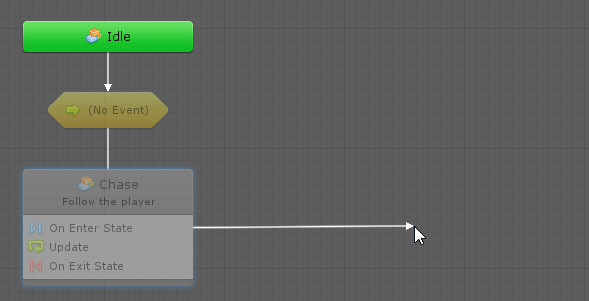

#Creating a Transition

States can be connected through transitions, which determines the order in which the states are run. 

To create a transition:

1. Right-click the source state and select **Make Transition**. 

2. Do one of the following:

   - Click on the destination state.

     

   
   
   - End the transition at an empty space in the graph to create a new state automatically.
     
     
     
     
     
   - **Ctr-click** (or **Cmd-click** on Mac) on the source node and drag to create a transition.
   
     
   
3. 

   
