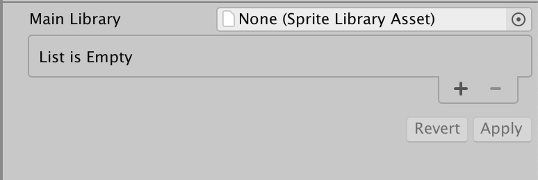
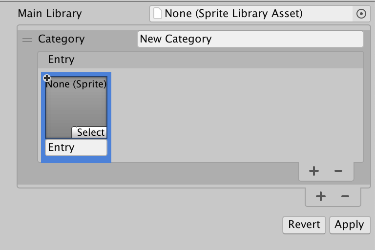
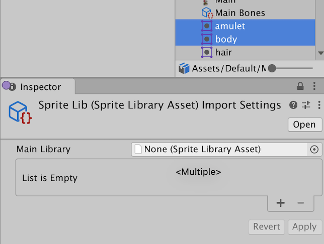
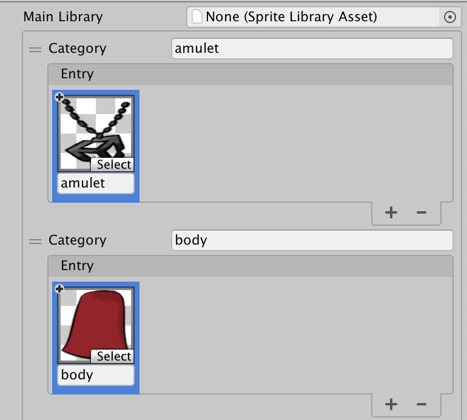
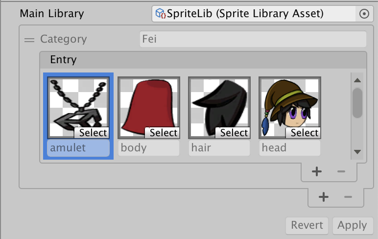
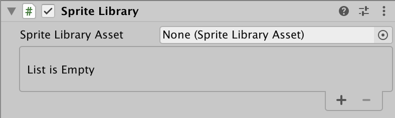
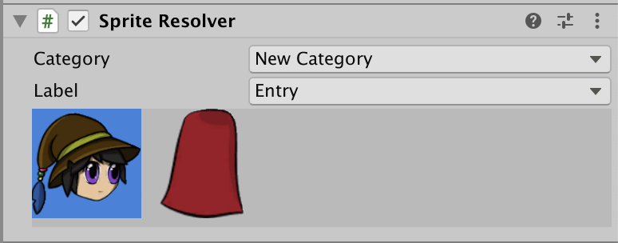

# Sprite Library Asset

A Sprite Library Asset groups multiple Sprites into [Categories](#category) and unique [Label](#entry) names. It is used in combination with the [Sprite Library](#sprite-library-component) component and [Sprite Resolver](#sprite-resolver) component to swap Sprite graphics at runtime.

To create the Asset, go to __Assets__ > __Create__ > **2D** > __Sprite Library Asset__.

## Sprite Library Asset Inspector window

Once the Sprite Library Asset is created, select the Asset and go to its Inspector window.

 Sprite Library Asset properties
Property  |Function  
--|--
**Main Library**  |  Assign another Sprite Library Asset here to have it become the main reference for the current Sprite Library Asset. The current Sprite Library Asset becomes a variant of the **Main Library**, which allows it to access the **Main Library**'s Categories and Entries. Refer to this feature's [documentation](#main-library) for more information about the functions and limitations of this feature.
**List**  |   Lists the [Categories](#category) contained in the Sprite Library Asset. Select **+** to add a new Category or **-** to remove the currently selected Category from the Sprite Library Asset.
**Revert**  |  This resets all Categories and Entries back to the last saved state. Unsaved changes are removed.
**Apply**  |  This saves the current state of Categories and Entries in the Sprite Library Asset.

### Category
A Category contains selected Sprites that have been grouped together for a common purpose.    

 Category window
Property  |Function  
--|--
**Category**  |Enter a unique name for this Category.  
**Entry**  | Displays the currently included Sprites in this Category as thumbnails. Select **+** to add a new Sprite to this Entry, or **-** to remove the currently selected Sprite.

### Entry
The Entry displays the Sprites contained in the selected Category.

 Selecting **+** adds a blank selection to the Entry.

Property  |Function  
--|--
**Select**  |  Click this to open the object picker window and select a Sprite for this selection.
**(Label Name)** | The name of this selection within the Entry, also referred to as its **Label**. The default name is 'Entry'.

 The selection after selecting a Sprite.

After selecting the Sprites and entering any changes, select **Apply** to ensure these changes are saved.

### Drag and drop
You can quickly populate Categories and Entries by dragging Sprites into the Sprite Library Asset’s Inspector window.

Dragging Sprites and Texture into an empty space on the Sprite Library's List will automatically create a new Category and Entry for those Sprites or Textures. The Sprite’s name will be used as the default name for the Category and Entry created in this way.

 An empty List.

 The Category and Entry are created and named after the Sprites are dragged into the List.

If a Category name matches the name of the Sprite, the Sprite will be added to that existing Category instead.

You can also quickly populate a specific Category by dragging Sprites directly into a Category.

## Main Library
Assigning another existing Sprite Library Asset to the **Main Library** property of the current Sprite Library Asset allows the current Asset to access all Categories and Entries contained in the assigned Sprite Library Asset.

 Example: Sprite Library Asset showing the Categories and Entries retrieved from the **Main Library** property.

The Labels of the Categories and Entries retrieved from the Main Library property cannot be changed or removed. However, you can add new Entries to a Category which was retrieved from the Sprite Library Asset assigned to the **Main Library** property.

You can also edit an Entry to change the Sprite that it refers to by selecting **Select** and choosing a different Sprite in the Object Picker window. To revert changes to a Sprite, select the inner **-** to restore it to the original Sprite that was retrieved from the Main Library.

 Sprite Library Asset showing the Sprite of an Entry has been modified.

### Modified Sprites
 Example: A Sprite retrieved from the Main Library that has been modified.

The **+** icon appears on a Sprite when:

1. The Entry is added to the Sprite Library Asset in a Category retrieved from the **Main Library**.
    
2. The Sprite for this Entry that was originally retrieved from the **Main Library** property has been changed.

When assigning a Sprite Library Asset to the **Main Library** property, if the same Category name already exists in the current Sprite Library Asset, then the Entries from both Categories will be merged into a single Category.

Similarly, any Entries in the same Category that have the same names will be merged. The Entry will use the Sprite that was referred to in the current Sprite Library Asset instead of the one from the **Main Library** if they are merged.

When a Sprite Library Asset is removed from the **Main Library** property, any changes that were made to the current Sprite Library Asset will remain.

## Sprite Library component

The Sprite Library component is used to define which Sprite Library Asset a GameObject refers to at runtime. Attach this component to a GameObject or any parent GameObject of a Sprite Resolver component to allow the [Sprite Resolver](#sprite-resolver-component) to change the Sprite that is being used by a [Sprite Renderer](https://docs.unity3d.com/Manual/class-SpriteRenderer).

In the Sprite Library component’s inspector, you can assign the desired Sprite Library Asset to use.

By assigning a Sprite Library Asset, the component’s Inspector will show a preview of the content in the Sprite Library Asset

Similar to the [Sprite Library Asset](#sprite-library-asset-inspector-window)’s Inspector window, you can add new Categories, change the Sprite an Entry refers to, and add a new Sprite Entry into the Category in Sprite Library component's Inspector window.

## Sprite Resolver component
The Sprite Resolver component is attached to each GameObject in the Prefab. The component pulls information from the [Sprite Library Asset](SLAsset.md) (assigned to the [Sprite Library component](SLComponent.md) at the root of the Prefab). The component contains two properties - [Category and Label](SpriteVis.html#sprite-tab) - and a visual Variant Selector that displays thumbnails of the Sprites contained in the Sprite Library Asset.

 Inspector view of Sprite Resolver component.

| Property     | Function                                                     |
| ------------ | ------------------------------------------------------------ |
| __Category__ | Select which Category you want to use a Sprite from for this GameObject. |
| __Label__    | Select the Label of the Sprite you want to use for this GameObject. |
|(Visual variant selector)   |Displays selectable thumbnails of the Sprites contained in this Category.   |

Select the Sprite you want the **Sprite Renderer** to render by selecting from the **Category** and **Label** dropdown menus, or select the Sprite directly in the visual variant selector.

### Animation keyframe changes in version 6.0

The Sprite Resolver has been changed in 2D Animation version 6.0 onwards so that when the component is keyframed in the Animation window, one consolidated property change is recorded instead of the two property changes in previous versions.

 The previous Sprite Resolver key.

 The Sprite Resolver key from Animation 6.0 onwards.
