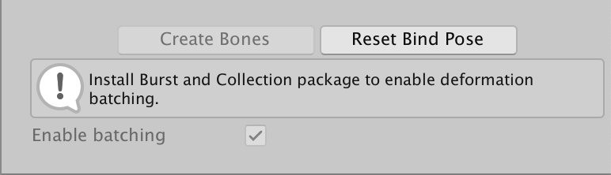
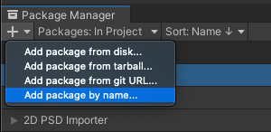

# Sprite Skin component
When this component is added to a GameObject that also contains the [Sprite Renderer](https://docs.unity3d.com/Manual/class-SpriteRenderer.html) component with a Sprite assigned, the Sprite Skin component deforms that Sprite by using GameObject Transforms to represent the bones that are [rigged](CharacterRig.md) and weighted to the Sprite  in the [Skinning Editor](SkinningEditor.md).

After [preparing and importing](PreparingArtwork.md) your artwork into Unity, bring the generated Prefab into the Scene view and Unity automatically adds the Sprite Skin component to the Prefab. This component is required for the bones deform the Sprite Meshes in the Scene view.

The Sprite Skin deforms a Sprite by using GameObject Transforms to represent the bones that are setup in the Sprite from the Skinning Editor module.

 Sprite Skin component settings.

Property            | Function
--------------------|-----------------------------------------------------------------------------------------------------------------------------------------------------------------------------------------------------------------------------------------------------------------------------------------------------------------------------------------------------
**Always Update**   | Enable this to have the Sprite Skin will continue to deform the Sprite even when the visual is not in the view of the Camera.
**[Auto Rebind](#auto-rebind)**     | Enable this to have the component attempt to find the correct GameObject Transforms to use as bones for the Sprite by using the GameObject Transform set in the **Root Bone** property as the starting point.
**Root Bone**       | The property is use to indicate which GameObject Transform will be use as the Root Bone for the Sprite.
**Bones**           | This shows the list of bones that are being setup for the Sprite in the Skinning Editor module. For each Sprite’s **Bone** entry, there needs to be a GameObject Transform associated with it so that deformation can be done correctly.
**Create Bones**    | The button allows users to create GameObject Transform(s) to represent the Sprite’s Bone and assign them to the **Root Bone** property and the individual Bones entry. The Root Bone that will be created will be placed as a child of the GameObject of the Sprite Skin. The button will only be enabled if the Root Bone property is not assigned.
**Reset Bind Pose** | The button resets the GameObject Transforms assigned in the Bones entry to the bind pose value setup for the Sprite in the Skinning Editor module.
**Enable Batching** | When this is enabled, the deformation for the Sprite by Sprite Skin will be done in batch for [optimization purposes](#optional-performance-boost). This option is only available when the Burst package and Collection package is installed. If either of them is not installed, the checkbox will be disabled and following information will be shown in the inspector.
-  |  

## Auto Rebind
When you enable **Auto Rebind**, Sprite Skin will attempt to automatically locate the GameObject Transform that is needed for the current Sprite assigned to the Sprite Renderer. This is triggered when the Sprite in the Sprite Renderer property is changed.

When a rebind is required, the Sprite Skin will look for the GameObject Transform name that matches the bone name in the Skinning Editor module.

 Example: Selecting a Sprite in the [Bone Panel](SkinEdToolsShortcuts.md#bone-panel) shows the bones currently rigged to and influencing the Sprite, along with their names.

In the above example, the Sprite is rigged with three connected bones - starting with 'bone_1' as the root bone, 'bone_2' as a child of 'bone_1', and 'bone_3' as a child of 'bone_2'.

For the Sprite Skin component to automatically locate the bones successfully, GameObject Transforms with the same name and hierarchy as shown in the above example must be available in the Scene.

By setting the Sprite Skin’s **Root Bone** property to the correct GameObject Transform, Sprite Skin will then map the GameObject Transform to the Sprite’s rigged bone of the same name. This method requires that the name and hierarchy of the rigged bones and the GameObject Transforms must match for the **Auto Rebind** to be successful. This means that changing the name of the bones in the Skinning Editor will require you to change the names of the GameObject Transforms to match as well.

## Optional performance boost
When animating your characters, you can improve the performance of the animated Sprite’s deformation at runtime by installing both the [Burst](https://docs.unity3d.com/Packages/com.unity.burst@latest) and [Collections](https://docs.unity3d.com/Packages/com.unity.collections@latest) package from the [Package Manager](https://docs.unity3d.com/Manual/upm-ui.html). This allows the 2D Animation package to use Burst compilation to speed up Unity’s processing of Sprite Mesh deformation.

The **Burst** package is visible by default in the **Package Manager**, however the **Collections** package is not publicly visible. To install the **Collections** package, follow these steps:
1. Open the **Package Manager**.
2. Press **+** at the upper-left corner of the **Package Manager** window to open a drop-down menu, then select **Add package by name…** from the list of options.    
3. In the **Name** box, enter “com.unity.collections”, then select **Add**.   

After completing these steps, the **Collections** package is added to the Project.

 The **Sprite Skin** component settings.

With both packages installed, __Enable batching__ becomes available in the [Sprite Skin component](SpriteSkin.md) properties. Note that if you do not have the required packages installed, the option will be disabled, with a notification to installed the required packages.

 

The package has been tested with [Burst](https://docs.unity3d.com/Packages/com.unity.burst@latest) version 1.3.3 and [Collections](https://docs.unity3d.com/Packages/com.unity.collections@latest) version 0.9.0-preview.6. However if you encounter an bugs, you may switch back to the previous implementation by clearing the __Enable batching__ option.
