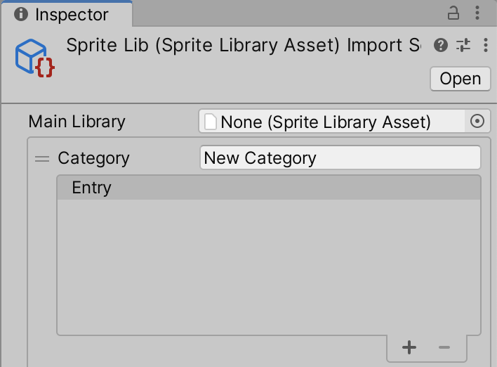

# Sprite Swap setup
Follow the steps below to create a [Sprite Library Asset](SLAsset.md), and choose which GameObjects refer to the Asset:

1. Select the Sprite Library Asset from the Asset creation menu by going to **Asset > Create > 2D > Sprite Library Asset** 
    
2. Select the new Sprite Library Asset and go to its Inspector window. The window displays the list of [Categories](SLAsset.md#category) and [Labels](SLAsset.md#entry) available in the Asset. 
    
3. Select **+** at the lower right of the List to add a new Category. Enter a name into **Category** (the default name is 'New Category'). Each Category in the same Sprite Library Asset must have a unique name. 
    
4. Add new Entries into the Category by either selecting **+** and then selecting a Sprite from the Object Picker window; or by [dragging](SLAsset.md#drag-and-drop) a Sprite or Texture onto an empty space within the Entry  
    
5. Next, create an empty GameObject (menu: Right-click on the **Hierarchy window > Create Empty**). Select it and then add the Sprite Renderer component. 
    
6. Add the [Sprite Library](SLAsset.md#sprite-library-component) component to the same GameObject. Assign the Sprite Library Asset created in step 3 to **Sprite Library Asset**. 
    
7. Add the [Sprite Resolver](SLAsset.md#sprite-resolver-component) component to the same GameObject. 
    
8. Open the **Category** drop-down menu, and select a Category you created in step 3. The **Label** drop-down menu will become available and display thumbnails of the Sprites contained in the Category. 
    
9. Select a Sprite in the Sprite Resolver component to replace the current Sprite rendered by the Sprite Renderer component with the one you have selected.
