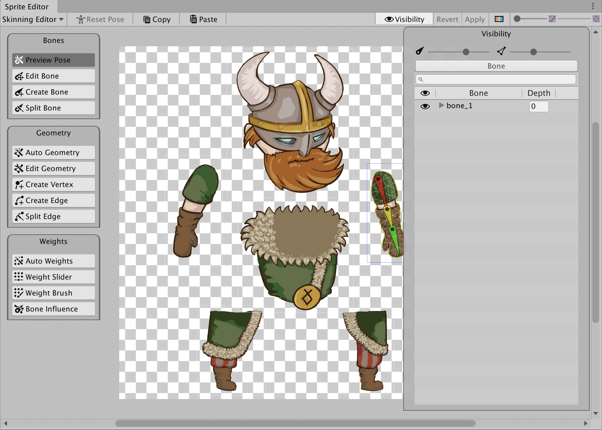
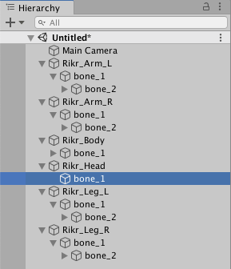

# Multiple Sprites from a single imported Texture
This sample shows a rigged actor that is made out of multiple Sprites. The Sprites are derived from a single imported Texture, which was imported with its **Texture Type** set to Sprite (2D and UI) and **Sprite Mode** set to Multiple.

Open the Asset `Assets/Samples/2D Animation/[X.Y.Z]/Samples/3 Multiple Skinned Sprites/Sprites/Rikr.png` in the [Skinning Editor](SkinningEditor.md) module to examine how the Sprite is rigged.

The `_Multiple Skinned Sprites` sample Scene shows how the Asset is used in a Scene when it is animated with animation that [deforms](SpriteSkin.md) its Sprite mesh.

Follow the steps below to reconstruct the `_Multiple Skinned Sprites Sprite` sample Scene:

1. Create an empty GameObject, and add the [Sprite Renderer](https://docs.unity3d.com/Manual/class-SpriteRenderer.html) to it. Assign one of the Sprites of `Rikr` to the component's **Sprite** property.
    
2. Add the [Sprite Skin](SpriteSkin.md) component to the GameObject, and go to the component's Inspector window. Select **Create Bones** to create GameObject Transforms which represent the bones of this Sprite. 
    
3. Repeat steps 1 to 2 for each Sprite in the `Rikr` Asset. Go to the [Skinning Editor](SkinningEditor.md), and [create and rig the bones](SkinEdToolsShortcuts.md#bone-tools) of the actor as shown in the fully constructed example.
    
4. Arrange the GameObjects created in steps 1-2 so that they form the actor in its neutral position. To control the Sprite drawing order (which determines which Sprites appear above the others), go to each GameObject's Sprite Renderer and adjust the value of its  **Order In Layer** property.  Bones created in the Skinning Editor but the GameObjects are clumped together in the Scene view.  The GameObjects rearranged to mimic the original actor.
    
5. Create another GameObject at the root of all the GameObjects, and call it 'Rikr_Root'. Reparent the 'Rikr_Body' GameObject to the 'Rikr_Root' as its child.
    
6. Add the [Animator component](https://docs.unity3d.com/Manual/class-Animator.html) to the 'Rikr_Root' GameObject. Locate the Rikir [Animator Controller Asset](https://docs.unity3d.com/Manual/Animator.html) in `Assets/Samples/2D Animation/[X.Y.Z]/Samples/3 Multiple Skinned Sprites/Animation/Animator/Rikr` and assign this Asset to the Animator’s **Controller** property.
