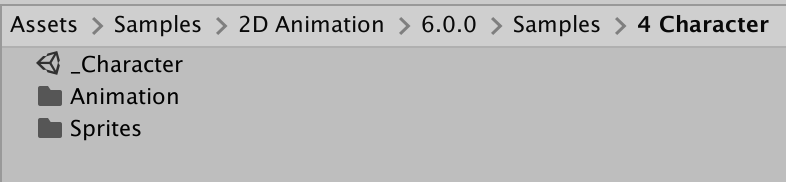

# Rigging a character imported with the PSD Importer
Note that the following example requires the [PSD Importer](https://docs.unity3d.com/Packages/com.unity.2d.psdimporter@latest) installed. This sample demonstrates how to rig an actor that is made from multiple Sprites, when its source file is imported with the [PSD Importer](https://docs.unity3d.com/Packages/com.unity.2d.psdimporter@latest/).

Open the Asset `Assets/Samples/2D Animation/[X.Y.Z]/Samples/4 Character/Sprites/Fei.psb` in the [Skinning Editor](SkinningEditor.md) module to examine how the Sprite is rigged.

The `_Character` sample Scene shows how the Asset is used in a Scene, when it is animated  with animation that [deforms](SpriteSkin.md) its Sprite mesh.

Follow the steps below to reconstruct the `_Character` sample Scene:

1. In this sample, the source file `Fei.psb` is imported into the Editor with the PSD Importer with its **Character Rig** property enabled. The importer generates a Prefab as a sub-Asset of the imported source file. The importer generates Sprites based on the layers of the source file. Refer to the [PSD Importer](https://docs.unity3d.com/Packages/com.unity.2d.psdimporter@latest) documentation for more information about the importer's features.
    
2. In this sample, the actor's bones are already rigged and weighted. Experiment editing the bones and mesh with the Skinning Editor's [various tools](SkinEdToolsShortcuts.md).
    
3. Drag the generated Prefab from the Project window into the Scene. This becomes a GameObject named 'Fei'.
    
2. Add the [Animator component](https://docs.unity3d.com/Manual/class-Animator.html) to the 'Fei' GameObject. Locate the Fei [Animator Controller Asset](https://docs.unity3d.com/Manual/Animator.html) in `Assets/Samples/2D Animation/[X.Y.Z]/Samples/4 Character/Animation/Animators/Fei.controller` and assign this Asset to the Animator’s **Controller** property.
