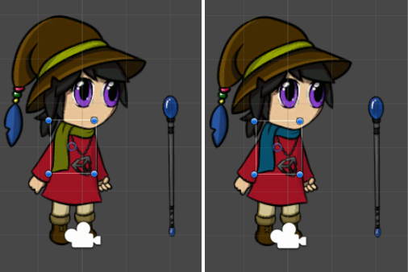
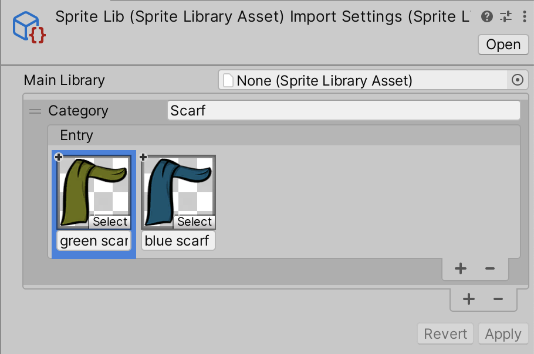
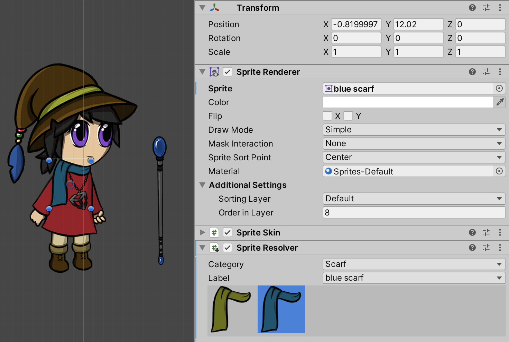

# Swapping parts of an actor
You can use __Sprite Swap__ to change only one Sprite on the actor without affecting the other Sprites. This allows you to alter part of an actor's visuals (for example, changing its clothes or skin to a different color) while keeping the rest of the visuals the same.

In the following example, there are two Sprites that are variations of the actor’s scarf, with one being green and the other being blue. This workflow demonstrates how to switch from one to the other in the same actor:

 __Left:__ The original green scarf. __Right:__ An alternate blue scarf.

1. Place the Sprites for both scarves into the same [Sprite Library Asset](SLAsset.md), and add them both to the same Category (named ‘Scarf’).
    
2. Give each of the Sprites a unique __Label__ name. 
    
3. In the Scene, select the [Instantiated Prefab](https://docs.unity3d.com/Manual/InstantiatingPrefabs.html) and then select the ‘Scarf’ GameObject the Hierarchy window.
    
4. Go to the [Sprite Resolver component](SLAsset.md#sprite-resolver-component) of the ‘Scarf’ GameObject. The Sprite Resolver‘s visual selector displays the two Sprites available in the ‘Scarf’ Category. 
    
5. Select the ‘blue scarf’ to switch the Sprite rendered by the ‘Scarf’ GameObject to it instead.  The Sprite Resolver's Label is set to 'blue scarf'.

If you want to switch more than one Sprite at a time, consider [swapping the Sprite Library Asset](SLASwap.md) to switch to an entire alternate set of Sprites.
