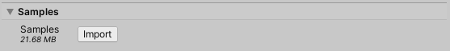

# Sample projects
Sample projects are available for import from the Package Manger under **Samples**, which demonstrate the different ways you can use the features in the 2D Animation package to achieve a variety of effects and outcomes.
 Select **Import** to download and install the Sample projects and Assets.

Each Sample project contain specific examples with ready-made Assets, demonstrating a certain way you can use the 2D Animation package's features and the results and outcomes you can achieve with them.

When the import is complete, Unity installs the Sample projects to `Assets/Samples/2D Animation/[X.Y.Z]/Samples`; where `[X.Y.Z]` is the version of the currently installed 2D Animation package.

The following is the list of Sample projects and their respective documentation. Note that some of these Samples require and refer to the [PSD Importer](https://docs.unity3d.com/Packages/com.unity.2d.psdimporter@latest/) package:

- [Simple](ex-simple.md)  - a single Sprite rig with simple bone hierarchy and rigging.
- [Single Skinned Sprite](ex-single-skinned-sprite.md) - a more advance single Sprite actor.
- [Multiple Skinned Sprites](ex-multiple-skinned-sprites.md) - Multiple Sprites from a single Texture
- [Character](ex-psd-importer.md) - Imported with the PSD Importer
- [Sprite Swap](ex-sprite-swap.md) - - Contains examples of the many different ways that Sprite Swap can be used.
  - [Flipbook Animation Swap](ex-sprite-swap.md#flipbook-animation-swap)
  - [Animated Swap](ex-sprite-swap.md#animated-swap)
  - [Part Swap](ex-sprite-swap.md#part-swap)
  - [Full Skin Swap](ex-sprite-swap.md#full-skin-swap)
  - [DLC Swap](ex-sprite-swap.md#dlc-swap)
  - [Skeleton Sharing](ex-skeleton-sharing.md)
  - [Runtime Swap](ex-runtime-swap.md)
