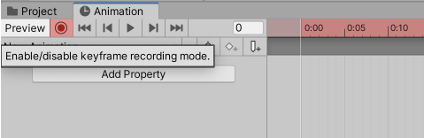
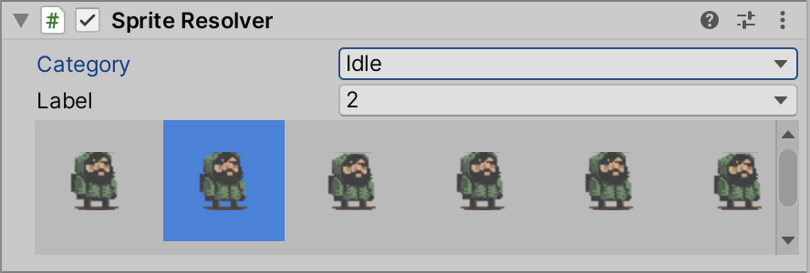
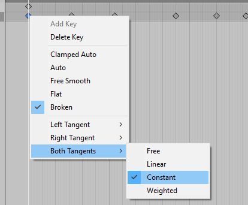

# Frame-by-frame animation

By using [Sprite Swap](SpriteSwapIntro.md), you can create frame-by-frame style animations by swapping to different Sprites on each frame at runtime. This is useful for simple animations, such as to show a character blinking. It is recommended that you first [change the keyframe tangent](#changing-the-keyframe-tangent) before continuing with the workflow below. The following steps assume that you have a working knowledge of the [Sprite Library Asset](SLAsset.md) features.

1. Create a Sprite Library Asset and add a new **Category**.
    
2. Add the Sprite for each frame of the animation to this **Category**, and give each of the Sprites a unique **Label** name.
    
3. Create a GameObject and add the [Sprite Renderer](https://docs.unity3d.com/Manual/class-SpriteRenderer.html) component to it, then add the [Sprite Resolver](SLAsset.md#sprite-resolver) component to it.
    
4. Open the [Animation](https://docs.unity3d.com/Manual/AnimationOverview.html) window, and select the GameObject from step 3. Create a new [Animation Clip](https://docs.unity3d.com/Manual/animeditor-CreatingANewAnimationClip.html) if required.
    
5. Enable [keyframe recording](https://docs.unity3d.com/Manual/animeditor-AnimatingAGameObject.html) in the Animation Window. 
    
6. Go to the Sprite Resolver’s Inspector window, and select the **Category** and **Label** for the Sprite that you want to start the animation clip from. . The selected Sprite is recorded to that keyframe.
    
7. Repeat step 6 by replacing the Sprite with the next one in sequence. By changing the **Category** and **Label** values of in Sprite Resolver, the frame-by-frame animation style is simulated.

## Changing the Keyframe Tangent

When animating by changing the **Category** and **Label** value of the Sprite Resolver in the Animation window, it is important to change the keyframe’s tangent in the Animation window to __Constant__.

This is because the Sprite Resolver component uses the defined string hash value to locate the desired Sprite. If the values between keyframe’s are interpolated, the Sprite Resolver will not be able to resolve and render the correct Sprite.

## Sprite Swap sample projects
Several Sample projects demonstrating the different ways you can use Sprite Swap are available for import with the 2D Aniamtion package. Refer to the documentation here for information and explanation of the
