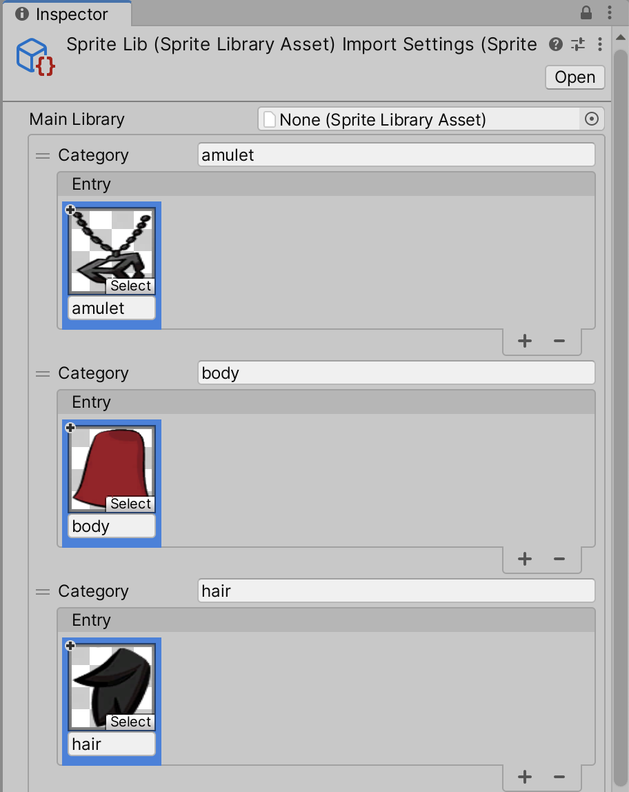
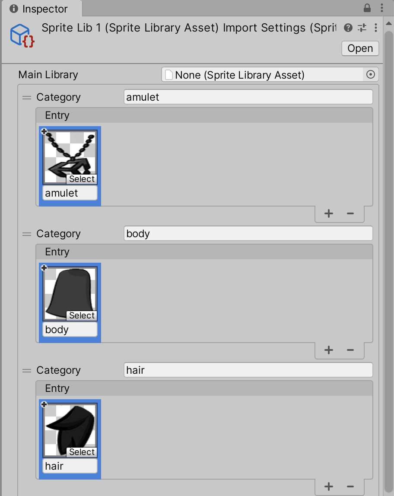
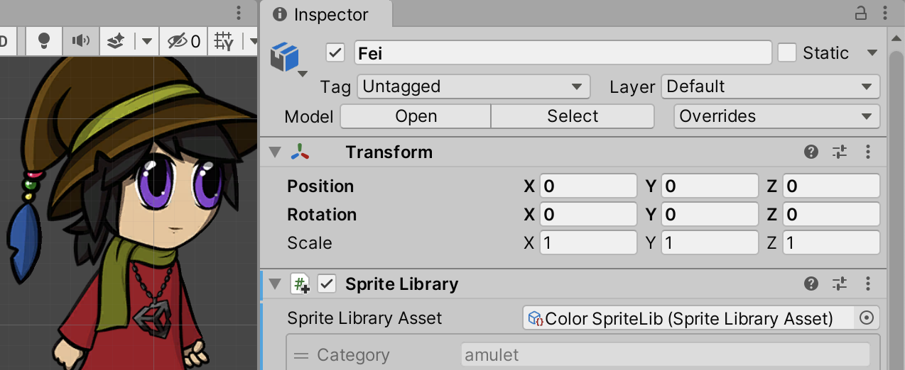
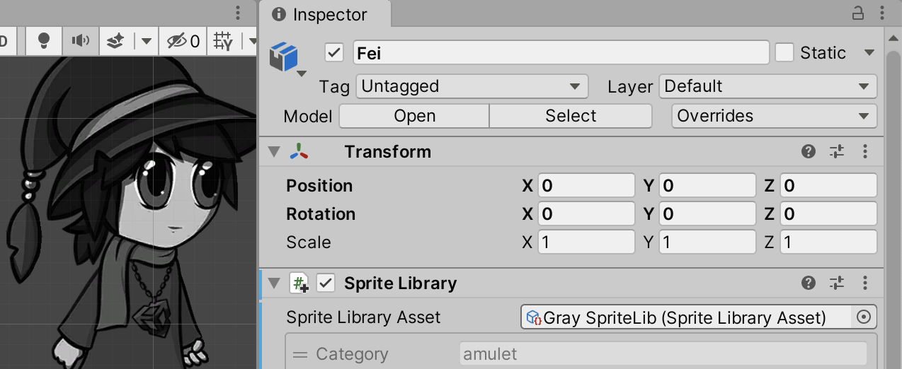

# Swapping Sprite Library Assets
If [swapping each Sprite of an actor individually](CharacterParts.md) takes too much effort, you can instead swap the entire __Sprite Library Asset__ to another one containing alternate Sprites.

The following example shows how to switch from a Sprite Library Asset of color Sprites to another one containing identical Sprites but in grayscale:

 __Left:__ An actor with the color Sprite Library Asset. __Right:__ The same actor with the grayscale Sprite Library Asset.

1. First create visual variants of your actor's artwork. In this example, the original artwork is in color and a grayscale variant of it is created as an alternate Sprite set. Both should be saved to separate .psb files.
    
2. [Import](PreparingArtwork.md) both .psb files into the Unity Editor. Both become separate Model Prefabs in the Asset window.
    
3. [Create a Sprite Library Asset](SpriteSwapSetup.md) and assign each Sprite of the actor to a unique [Category](SLAsset.md#Category). It is suggested to name each Category and Label after the respective body part of the actor for convenience. Apply the changes once complete.  The Category and Label names for the parts of the color actor.
    
4. Repeat step 3 for the grayscale actor. Use the same Category and Label names for the corresponding gray Sprites.  The grayscale Sprites with the same corresponding Category and Label names.
    
5. Drag the color Model Prefab into the Scene view, and go to the root GameObject. Add a [Sprite Library component](SLAsset.md#sprite-library-component) to the root GameObject and assign the color Sprite Library Asset created in step 3 to the **Sprite Library Asset** property. 
    
6. For every Sprite Renderer in the Instantiated Prefab, add a [Sprite Resolver component](SLAsset.md#sprite-resolver-component) and ensure that the Sprite Resolver component has the same Sprite selected as the Sprite Renderer.
    
7. With the Inspector window of the color Prefab root GameObject remaining open, go to the Asset window and assign the Sprite Library Asset created in step 4 to the **Sprite Library Asset** property of the Sprite Library component.
    
8. The Sprites of the color Prefab should have switched to their grayscale counterparts of the grayscale Sprite Library Asset.  The Sprite Library Asset property is set to the grayscale version of the original Sprite Library Asset and the actor's Sprites have switched accordingly.
