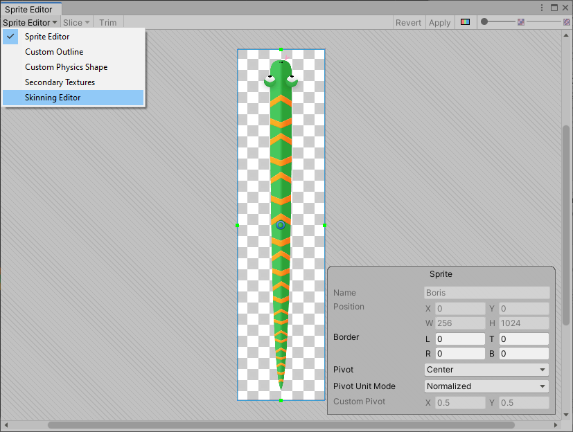
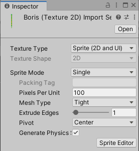
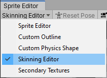
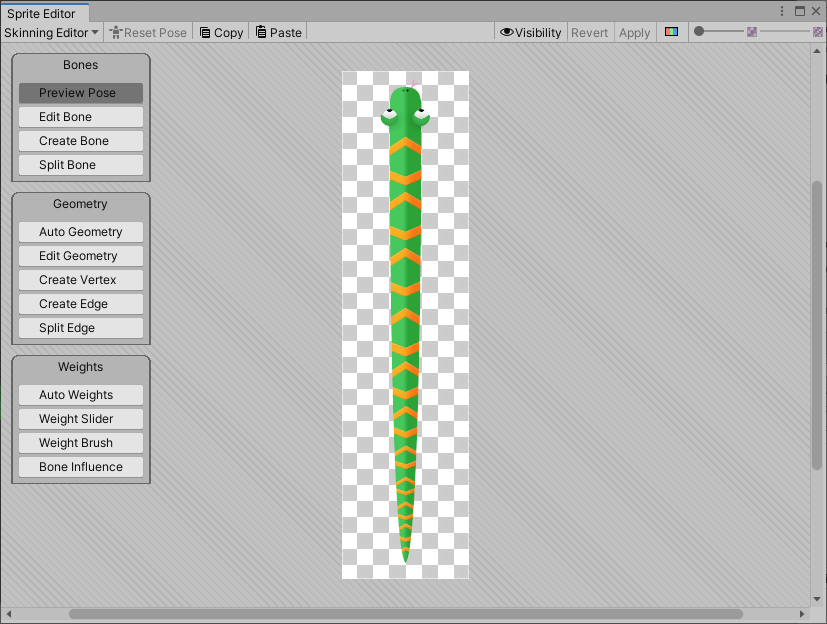
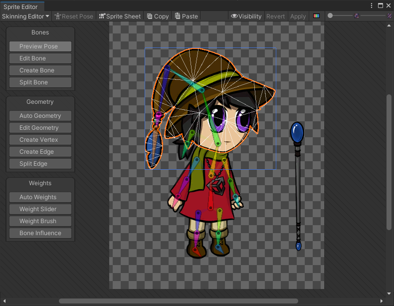
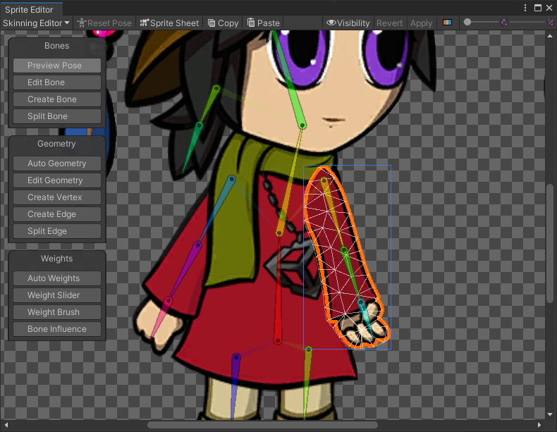

# Skinning Editor

The __Skinning Editor__ is a module which is added to the [Sprite Editor](https://docs.unity3d.com/Manual/SpriteEditor.html) after installing the 2D Animation package. Use the editor's [tools ](SkinEdToolsShortcuts.md) to create the [bones](SkinEdToolsShortcuts.html#bone-tools) of your actor's skeleton, generate and edit its mesh [geometry](SkinEdToolsShortcuts.html#geometry-tools), and adjust the [weights](SkinEdToolsShortcuts.html#weight-tools) that bind the bones to the meshes as you [rig your actor](CharacterRig.md).

 The Skinning Editor is found in the modules drop-down menu at the top left of the Sprite Editor.

## Opening the Skinning Editor

To begin working with an actor in the Skinning Editor:

1. First select the actor Prefab created after [importing](PreparingArtwork.md) your artwork into the Project, and go to its Inspector window.
    
2. Select the __Sprite Editor__ button in the Inspector window to open the actor in the Sprite Editor. 
    
3. In the Sprite Editor, select the Skinning Editor module from the upper left drop-down menu of the editor window.

   

 An actor in the Skinning Editor with the different panels of tools available.

Refer to the [editor tools and shortcuts](SkinEdToolsShortcuts.md) documentation for more information about the different tools and functions available in the Skinning Editor.

## How to select a Sprite in the editor

Depending on the actor, there may be multiple Sprites in the Skinning Editor at once. Select specific Sprites in the Skinning Editor window in the following ways:

1. Double-click a Sprite to select it in the editor window. An orange outline and wireframe appears on the selected Sprite. The color of the outline color can be changed in [Tool Preferences](ToolPref.md). 
    
2. If the Sprite you want to select is behind other Sprites, hover the cursor over where the desired Sprite is, and double-click to cycle through all Sprites at the cursor location until you select the desired Sprite. 
    
3. To deselect a selected Sprite, double-click on a blank area in the editor window.

## How to select bone or Mesh vertices in the editor

To select a bone or vertices when using the [Bone](SkinEdToolsShortcuts.html#bone-tools) and [Geometry tools](SkinEdToolsShortcuts.html#geometry-tools):

1. Click a bone or mesh vertex to select it specifically.
2. Draw a rectangle over multiple bones or vertices to make a multiple selection.
3. Right-click to deselect any selected bone or mesh vertices.
