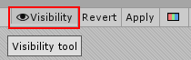
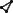
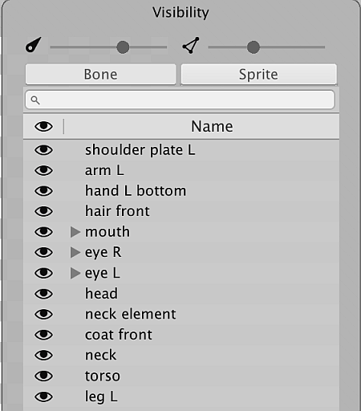
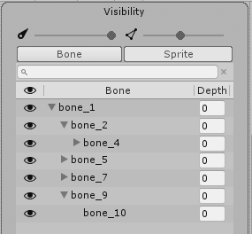
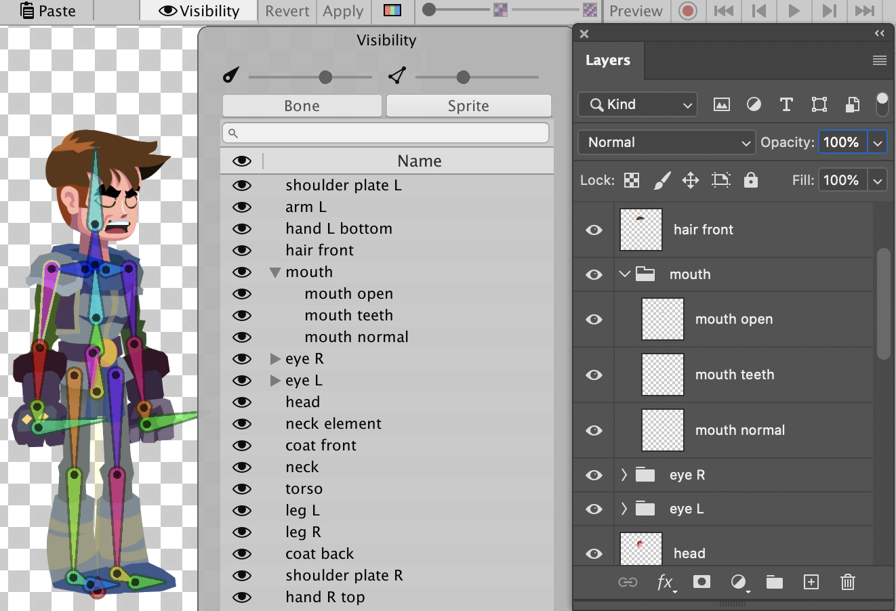

# Sprite Visibility panel
Toggle the __Sprite Visibility__ panel by selecting the __Visibility tool__ button along the upper right of the editor window:

The panel appears on the right-side of the editor window. It has two sliders at the top that control the visibility of the  bones and  Sprite meshes within the editor window. Move either slider further to the left to decrease the visibility of the bones or meshes respectively, and to the right to increase their visibility.

The **Bone** tab displays the [Bone hierarchy](#bone-tab-and-hierarchy-tree) of the character Prefab, and the **Sprite** tab displays the names of the Sprites and their grouping hierarchy.

**Note:** You will no longer be able to create or define a [Sprite Library Asset](SLAsset.md) within the Skinning Editor module from 2D Animation version 6.0 onwards, and the **Category** and **Label** columns have been removed from the Sprite Visibility panel. Please refer to the [Sprite Library Asset documentation](SLAsset.md) for more information.

## Bone tab and hierarchy tree

 The Bone tab selected.

Select the __Bone__ tab to view the list of bones in the character Prefab. The list reflects the hierarchy of bones you created with the [Bone tools](SkinEdToolsShortcuts.html#bone-tools). You can reparent and reorder bones directly from the bone tab by dragging selected bones up and down the list. Toggle the visibility of each bone by selecting the  icon next to it.

| Property                        | Function                                                     |
| ------------------------------- | ------------------------------------------------------------ |
|  | Toggle the visibility of each bone by selecting this icon next to the bone. |
| __Bone__                        | The name of the Bone.                                        |
| __Depth__                       | Displays the Z-value of bones that are influencing the same Sprite Mesh. The parts of the Mesh that is influenced by a bone with higher **Depth** value will render in front of the Mesh influenced by bones with lower **Depth** value.  A bone’s **Depth** value is 0 by default. To set a bone’s Depth value, select one of the available [Bone tools](SkinEdToolsShortcuts.html#bone-tools) and then select one of the bones. Find the [Bone panel](SkinEdToolsShortcuts.html#bone-panel) at the bottom right of the window, and enter the desired value to its __Depth__ property box. |

## Sprite tab

Select the __Sprite tab__ to see the list of Sprites that make up the character Prefab in the Skinning editor window. The names  and order of the Sprites mirror their names, layer and grouping order in the original source file.

