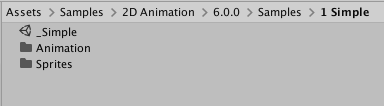
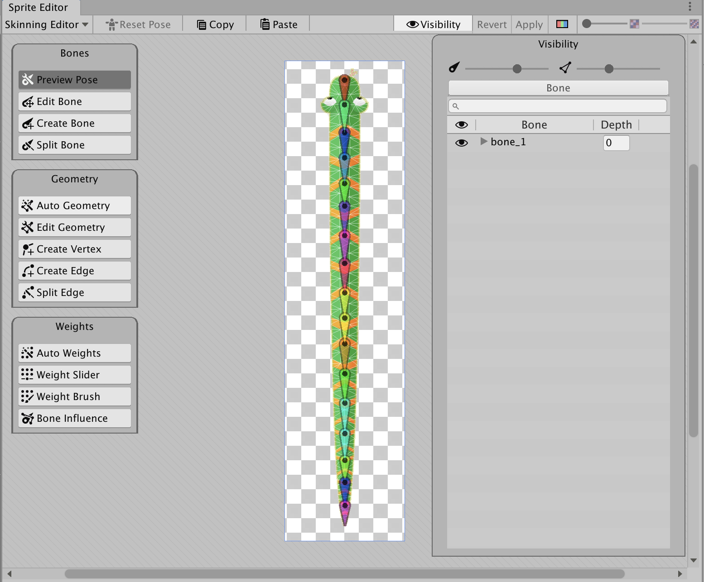
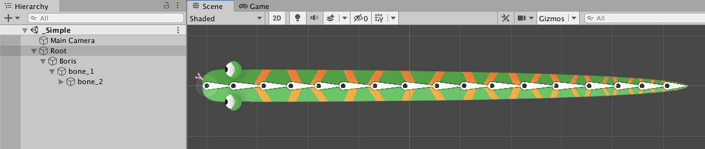
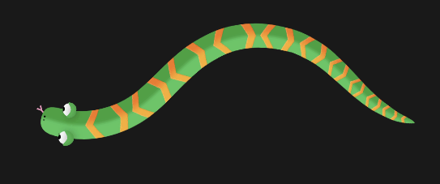
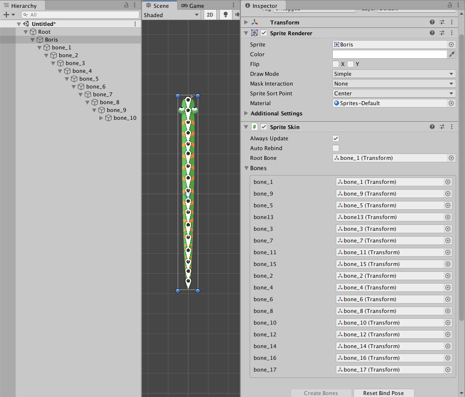

# Simple single Sprite actor and rig

This sample shows a simple single Sprite rigged actor, which was imported with its **Texture Type** set to Sprite (2D and UI) and **Sprite Mode** set to Single. The Project and Assets can be found in the following location (the version number folder may differ):

 Sample project location in the Project window (for 2D Animation 6.0).

Open the Asset `Assets/Samples/2D Animation/[X.Y.Z]/Samples/1 Simple/Sprites/Boris.png` in the [Skinning Editor](SkinningEditor.md) module to examine how the Sprite is rigged.

The `_Simple` Scene shows how the Asset is used in a Scene when it is animated with animation that [deforms](SpriteSkin.md) its Sprite mesh.

Follow the steps below to reconstruct this `_Simple` sample Scene:

1. Create a new Scene, and create two empty GameObjects. Name one 'Root', and the other 'Boris'.
    
2. Attach the 'Boris' GameObject to the Root GameObject as its child.
    
3. Add the [Sprite Renderer](https://docs.unity3d.com/Manual/class-SpriteRenderer.html) component to the 'Boris' GameObject.
    
4.  Assign the 'Boris' Sprite to the Sprite Renderer’s **Sprite** property.
    
5. Add the [Sprite Skin](SpriteSkin.md) component to the 'Boris' GameObject, and go to the component's Inspector window. Select **Create Bones** to create GameObject Transforms which represent the bones of this Sprite.

6. Add an [Animator component](https://docs.unity3d.com/Manual/class-Animator.html) to the 'Root' GameObject.
    
7. Locate the Root [Animator Controller Asset](https://docs.unity3d.com/Manual/Animator.html) in `Assets/Samples/2D Animation/[X.Y.Z]/Samples/1 Simple/Animation/Animator/Root.controller`. Assign this Asset to the Animator component's **Controller** property.
     
8. Add a Animator component to the 'Boris' GameObject. Locate the Boris [Animator Controller Asset](https://docs.unity3d.com/Manual/Animator.html) in `Assets/Samples/2D Animation/[X.Y.Z]/Samples/1 Simple/Animation/Animator/Boris.controller` and assign this Asset to the Animator’s **Controller** property.
