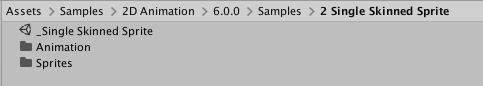
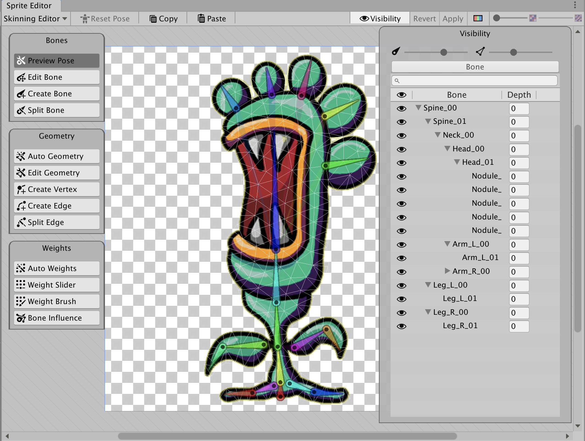
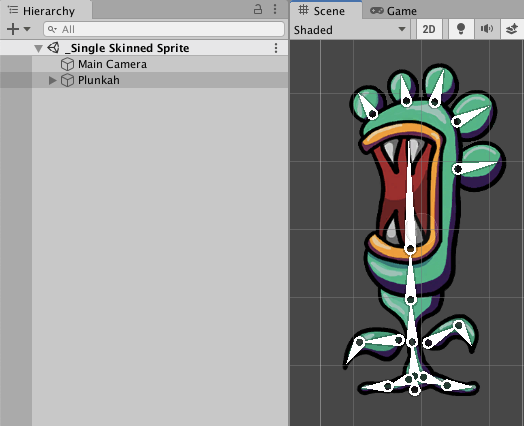

# Single Sprite rig with bone branching
This sample project is a slightly more complex example of a single Sprite rig similar to the [Simple](ex-simple.md)  project, but with bone branching instead of a single branch rig. The Sprite is imported with its **Texture Type** set to Sprite (2D and UI) and **Sprite Mode** set to Single.

The Project and Assets can be found in the following location (the version number folder may differ):

Open the Asset `Assets/Samples/2D Animation/[X.Y.Z]/Samples/2 Single Skinned Sprite/Sprites/Plunkah.png` in the [Skinning Editor](SkinningEditor.md) module to examine how the Sprite is rigged.

The `_Single Skinned Sprite` sample Scene show how the Asset is used in a Scene when it is animated with animation that [deforms](SpriteSkin.md) its Sprite mesh.

Follow the steps below to reconstruct the `_Single Skinned Sprite` sample Scene:

1. Create a new Scene, and create an empty GameObject. Name this GameObject 'Plunkah'.
    
2. Add the [Sprite Renderer](https://docs.unity3d.com/Manual/class-SpriteRenderer.html) component and go to its Inspector window. Assign the 'Plunkah' Sprite to its **Sprite** property.
    
3. Add the [Sprite Skin](SpriteSkin.md) component to the 'Plunkah' GameObject, and go to the component's Inspector window. Select **Create Bones** to create GameObject Transforms which represent the bones of this Sprite.
    
4. Add the [Animator component](https://docs.unity3d.com/Manual/class-Animator.html) to the 'Plunkah' GameObject. Locate the Plunkah [Animator Controller Asset](https://docs.unity3d.com/Manual/Animator.html) in `Assets/Samples/2D Animation/[X.Y.Z]/Samples/2 Single Skinned Sprite/Animation/Plunkah.controller` and assign this Asset to the Animator’s **Controller** property.
