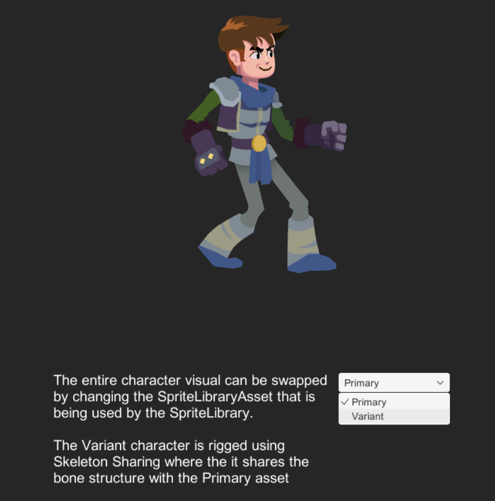
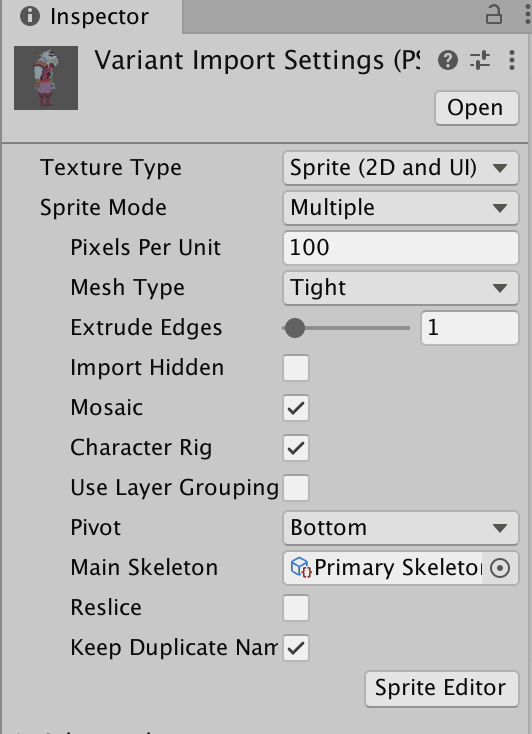
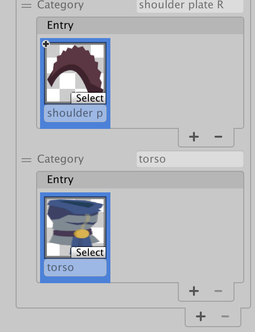
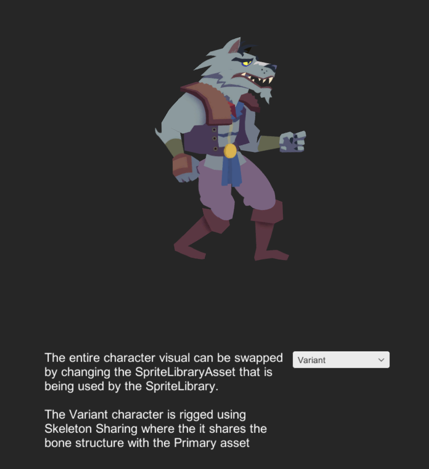

# Skeleton Sharing
This sample demonstrates how Skeleton sharing can be set up and leverages on the [other samples](Examples.md) before this. Note that the following requires the [PSD Importer](https://docs.unity3d.com/Packages/com.unity.2d.psdimporter@latest) installed. Open the `5 Skeleton Sharing.unity` Scene to see this sample in action.

This sample's setup is similar to the one in the [Full Skin Swap](#full-skin-swap) sample. However instead of using [multi-skinned Sprites](#ex-multiple-skinned-sprites), this example uses the Prefab generated by the PSD Importer. The visual Assets are located in `Assets/Samples/2D Animation/[X.Y.Z]/Samples/5 SpriteSwap/Sprites`:

- `Primary.psb`
- `Variant.psb`

The `Variant.psb` uses the [.skeleton Asset](https://docs.unity3d.com/Packages/com.unity.2d.psdimporter@5.0/manual/PSD-importer-properties.html#main-skeleton) from the `Primary.psb`, which means that the `Variant.psb` is prepared using the same skeleton structure as the `Primary.psb`.

The `Variant` actor also uses the following Sprite Library Assets located in `Assets/Samples/2D Animation/[X.Y.Z]/Samples/5 SpriteSwap/Sprites`:

- `Primary.spriteLib`
- `Variant.spriteLib`

The `Primary.spriteLib` is assigned to the **Main Library** property for the `Variant.spriteLib` is. The `Variant.spriteLib` has been setup so that the **torso** Category is not overridden, which allows it to use the Sprite from `Primary.spriteLib`.

 The Variant actor uses the same torso Sprite as the Primary actor.
