# Sprite Swap
This following sample projects demonstrate the different ways you can use Sprite Swap to achieve different effects and outcomes.


The Scenes for the following samples can be all found in `Assets/Samples/2D Animation/[X.Y.Z]/Samples/5 SpriteSwap`:

- [Flipbook Animation Swap](#flipbook-animation-swap)
- [Animated swap](#animated-swap)
- [Part swap](#part-swap)
- [Full skin swap](#full-skin-swap)
- [DLC swap](#dlc-swap)

## Flipbook Animation Swap
This sample demonstrates how to use Sprite Swap to create a reusable Animation Clip which mimics a flipbook-style animation. Open the Scene `1 Flipbook Animation Swap.unity` to see it in action.

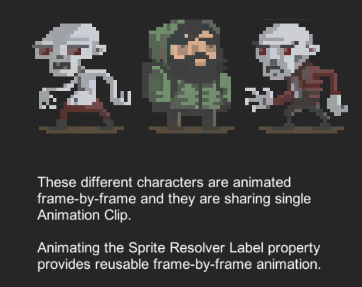

The three Sprite Library Assets used in this example are located in `Assets/Samples/2D Animation/[X.Y.Z]/Samples/5 Sprite Swap/Sprite Library`:

- `Hero.spriteLib`
- `Zombie1.spriteLib`
- `Zombie2.spriteLib`

The Sprites for these Sprite Library Assets are derived from `Scavengers_SpriteSheet.png`, which is located in `Assets/Samples/2D Animation/[X.Y.Z]/Samples/5 SpriteSwap/Sprites`. All three Sprite Library Assets have the same number of Categories; and their Categories and Entries have the same name.

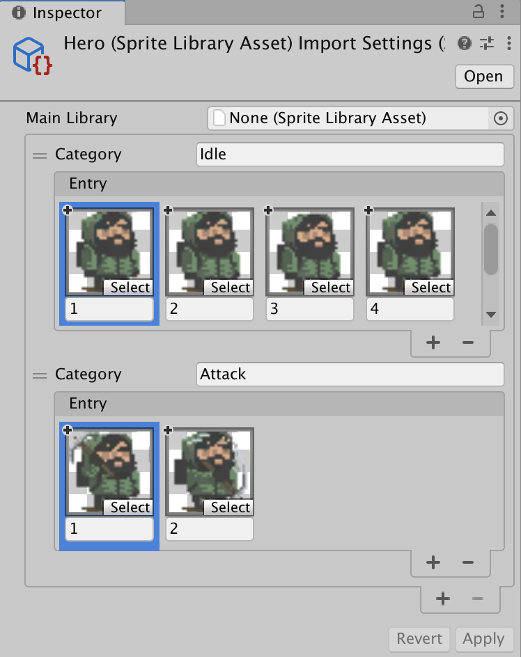<br/>The Categories and Label names of the `Hero.spriteLib`, which are identical to the two other Sprite Library Assets.

Follow the steps below to reconstruct the `1 Flipbook Animation Swap` sample Scene:

1. Create an empty GameObject and name it `Hero`. Add the [Sprite Renderer](https://docs.unity3d.com/Manual/class-SpriteRenderer.html) component and go to its Inspector window. Assign one of the Sprites used in `Hero.spriteLib`. to its **Sprite** property.
   <br/>
2. Add the [Sprite Library component](SLAsset.md#sprite-library-component) and assign the `Hero.spriteLib` to its **Sprite Library Asset** property. Then add the [Sprite Resolver component](SLAsset.md#sprite-resolver-component) to the same GameObject.
   <br/>
3. Add the [Animation component](https://docs.unity3d.com/Manual/class-Animation.html). Locate the `Scavengers.anim` [Animation Clip](https://docs.unity3d.com/Manual/AnimationClips.html) in `Assets/Samples/2D Animation/[X.Y.Z]/Samples/5 SpriteSwap/Animation` and assign this Asset to the component's **Animation** property.
   <br/>
4. Duplicate the `Hero` GameObject and rename the copy to `Zombie1`.
   - In `Zombie1`'s Sprite Renderer component, set its **Sprite** property to one of the Sprites used in `Zombie1.spriteLib`.
        <br/>
5. Duplicate the `Hero` GameObject again and rename the copy to `Zombie2`.
   - In `Zombie2`'s Sprite Renderer component, set the **Sprite** property to one of the Sprites used in `Zombie2.spriteLib`

All three GameObjects are now animated with the same Animation Clip. As the Animation Clip plays, the Sprite that each GameObject's Sprite Resolver refers to is swapped which creates the flipbook animation style. By using a different Sprite Library Asset for each GameObject, the same Animation Clip is reused with different Sprites.

## Animated Swap
This sample demonstrates how to use Sprite Swap to create a reusable Animation Clip for animations that include both Sprite swapping and [deformation](SpriteSkin.md) of the Sprites. Note that the following example requires the [PSD Importer](https://docs.unity3d.com/Packages/com.unity.2d.psdimporter@latest) installed.

Open the Scene file `2 Animated Swap.unity`to see the sample in action.

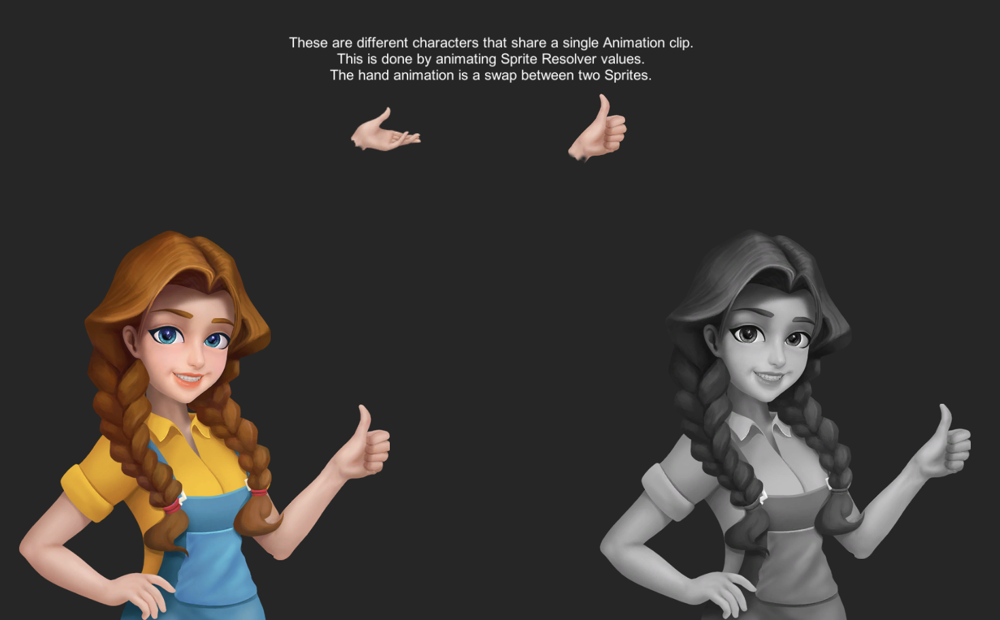<br/>Initial frame with the hands in thumbs-up position.

This sample builds on the reusable Animation Clip example from the [Flipbook Animation Swap](#flipbook-animation-swap) sample. This sample uses 2 different source files located in `Assets/Samples/2D Animation/[X.Y.Z]/Samples/5 SpriteSwap/Sprites`. The Assets used are:

- `dialog.psb`
- `dialog gray.psb`

These Assets are imported with the PSD Importer with its **Character Rig** property enabled. Both Assets are rigged with the same skeleton, and each Asset has two different Sprites for the hands which are swapped during the animation.

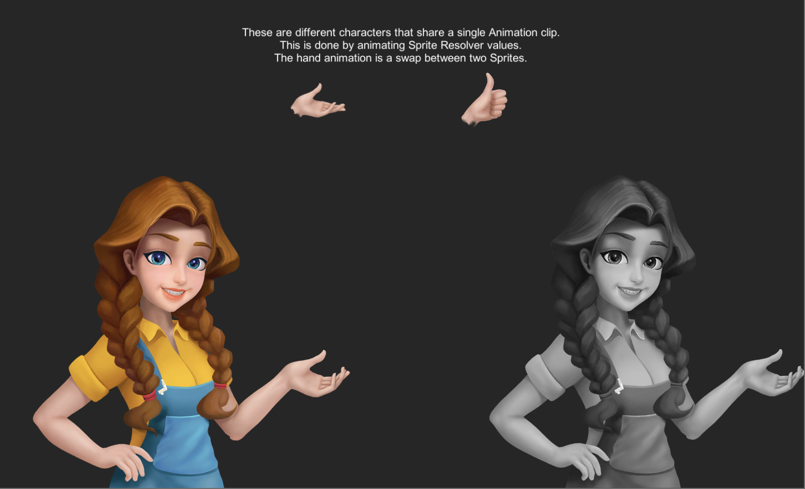<br/>Swapped to a frame with the hands open.

Two Sprite Library Assets are created using the same steps demonstrated in the [Flipbook Animation Swap](#flipbook-animation-swap) sample. They are located in `Assets/Samples/2D Animation/[X.Y.Z]/Samples/5 Sprite Swap/Sprite Library` and are:

- `dialog.spriteLib`
   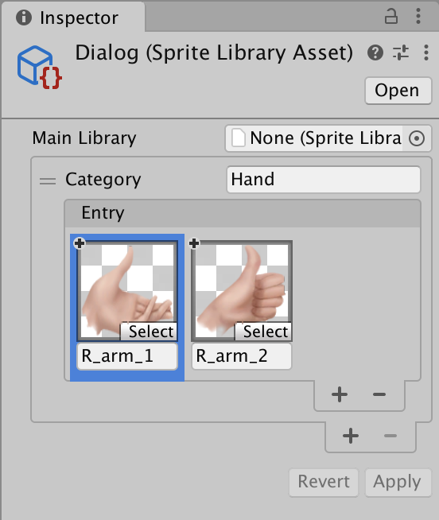
   <br/>
- `dialog gray.spriteLib`
   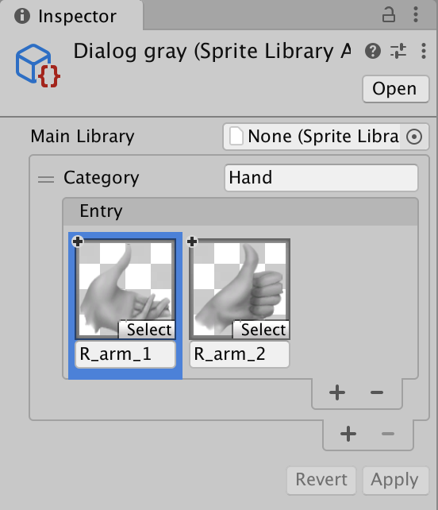

Follow the steps below to reconstruct the sample Scene:

1. Drag both `dialog.psb` and `dialog gray.psb` Prefabs from the Project window into the Scene.
   <br/>
2. Add the [Sprite Library component](SLAsset.md#sprite-library-component) to `dialog` GameObject, then assign the `dialog.spriteLib` Asset to its **Sprite Library Asset** property.
   <br/>
3. Add the [Sprite Library component](SLAsset.md#sprite-library-component) to `dialog gray` GameObject, then assign the `dialog gray.spriteLib` Asset to its **Sprite Library Asset** property.
   <br/>
4. Expand the `dialog` GameObject's hierarchy and disable the `R_arm_2` child GameObject. This Asset is not required as it will be swapped in during the animation.
   <br/>
5. Go to the `R_arm_1` GameObject, and add the [Sprite Resolver component](SLAsset.md#sprite-resolver-component). Select the `R_arm_2` graphic from the **Label** drop-down menu or from its thumbnail.<br/>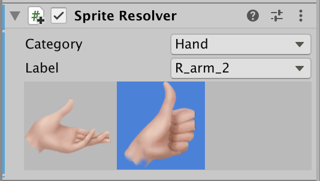
   <br/>
6. Repeat steps 4 to 5 with the `dialog gray` GameObject.
   <br/>
7. Add the [Animator component](https://docs.unity3d.com/Manual/class-Animator.html) to the `dialog` and `dialog gray` GameObjects. Locate the Dialog [Animator Controller Asset](https://docs.unity3d.com/Manual/Animator.html) in `Assets/Samples/2D Animation/[X.Y.Z]/Samples/5 Sprite Swap/Animation/Animators` and assign it to the Animator component's **Controller** property.

In this sample, the Sprite Library component is not attached to the same GameObject as the Sprite Resolver component. The Sprite Resolver will attempt to locate a Sprite Library component starting from the same GameObject it is on and then traverse up the GameObject hierarchy. This makes it possible to have a single or multiple Sprite Resolvers use the same Sprite Library component by attaching the Sprite Library component to a common root GameObject that the Sprite Resolver components are attached to.

## Part Swap
This sample demonstrates how to swap Sprite Assets using the API provided by changing the Sprite Resolver data. This sample uses some of the Assets and a similar setup to the [Multiple Skinned Sprites](ex-multiple-skinned-sprites) sample. Open the  `3 Part Swap.unity` Scene to see the sample in action.


In the Scene, each part has three different visual options that can be swapped. The graphic Assets are located in `Assets/Samples/2D Animation/[X.Y.Z]/Samples/5 SpriteSwap/Sprites`:

- `Rikr.png`
- `Rikr Poison.png`
- `Rikr Rage.png`

A [Sprite Library Asset](SLAsset.md) containing Sprites made from all three graphic Assets above is created. A Category is created for each body part of the actor, with three Entries derived from the three different versions of the character. The Asset is located in `Assets/Samples/2D Animation/[X.Y.Z]/Samples/5 SpriteSwap/Sprite Library/Rikr Full.spriteLib`.

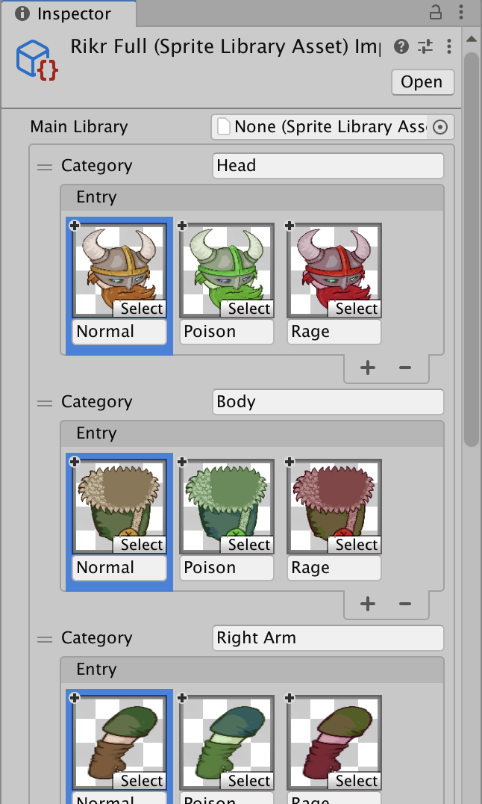Corresponding parts from each of the three versions of the actor, and named accordingly.

Attach the Sprite Library component to the `Rikr_Root` GameObject in the Scene. Assign the `Rikr Full.spriteLib` Asset to its **Sprite Library Asset** property.

Add the Sprite Resolver component to all Sprite Renderers under the `Rikr_Root` GameObject. Assign a Sprite that matches its corresponding GameObject, depending on the body part that GameObject represents. For example, select one of the Sprites in the 'Body' Category for the Sprite Resolver attached to the `Rikr_Body` GameObject and so on.

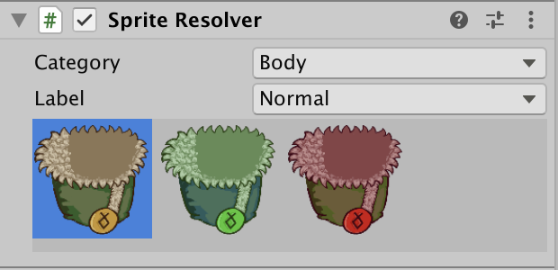

With this setup, you can swap any part of the actor to another Sprite individually.

### Swap part script
A custom MonoBehaviour script called `SwapPart` is attached to the `Rikr_Root` GameObject. This script is located in `Assets/Samples/2D Animation/[X.Y.Z]/Samples/5 SpriteSwap/Scripts/Runtime/SwapPart.cs`.

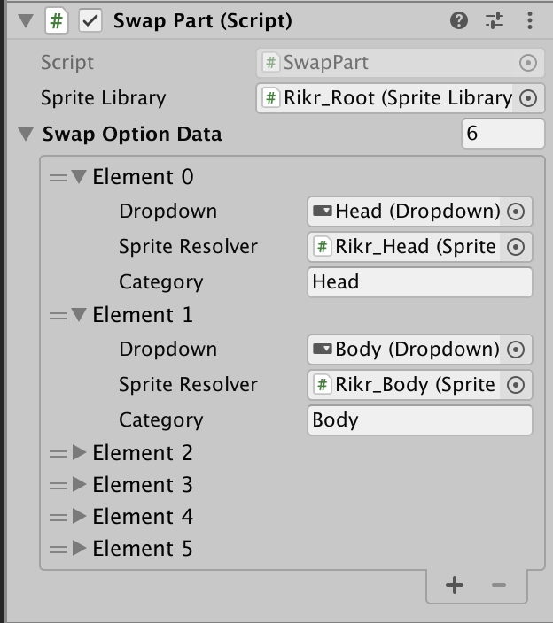

The script holds a reference to a Sprite Library component for retrieval of swappable Sprites. It also holds an array of data that describes the Category of Sprites in the Sprite Library that can be changed by a Sprite Resolver component.

When the Swap Part script starts up, it will attempt to fetch the Sprite Library Asset that is used by a Sprite Library component.

```c++
var libraryAsset = spriteLibrary.spriteLibraryAsset;
```
From this Sprite Library Asset, it will then fetch the Entries and Label names that are in a Category.

```c++
var labels = libraryAsset.GetCategoryLabelNames(swapOption.category);
```
This is then used to populate the UI Drop Down list.

When a value changes in the UI Drop Down List, it will then set the Sprite Resolver component to use the relevant Sprite.

```c++
swapOption.spriteResolver.SetCategoryAndLabel(swapOption.category, swapOption.dropdown.options[x].text);
```

## Full Skin Swap
This sample demonstrates how to swap Sprite visuals using the provided API by changing the [Sprite Library Asset](SLAsset.md) referenced by the Sprite Library component. Open the `4 Full Swap.unity` Scene to see the sample in action.

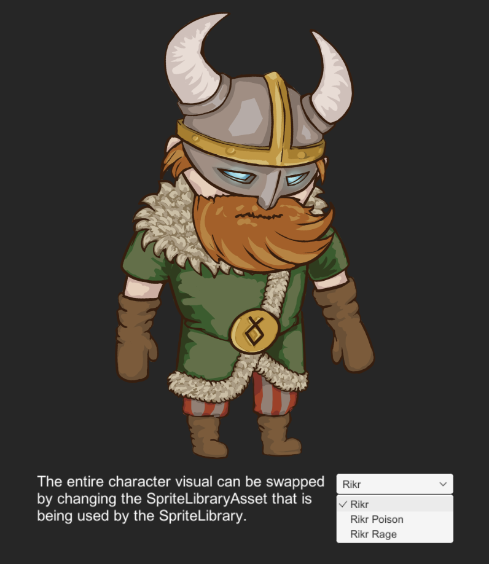

In the Scene, there are three different visual Asset options that you can swap to. The Assets are located in `Assets/Samples/2D Animation/[X.Y.Z]/Samples/5 SpriteSwap/Sprites`:

- `Rikr.png`
- `Rikr Poison.png`
- `Rikr Rage.png`

The Sprite Library Assets have identical Categories, Entries, and Label names but with different Sprites selected. The Assets are located in `Assets/Samples/2D Animation/[X.Y.Z]/Samples/5 SpriteSwap/Sprite Library`.

- `Rikr.spriteLib`
- `Rikr Posion.spriteLib`
- `Rikr Rage.spriteLib`

Attach the Sprite Library component to the `Rikr_Root` GameObject. Assign the `Rikr.spriteLib` Asset to its Sprite Library Asset property.

Add the Sprite Resolver component to each of the Sprite Renderers under the `Rikr_Root` GameObject. Assign a Sprite to each Sprite Resolver that corresponds to the body part they are attached to. For example, the `Body` Sprite is selected for the Sprite Resolver attached to the `Rikr_Body` GameObject.

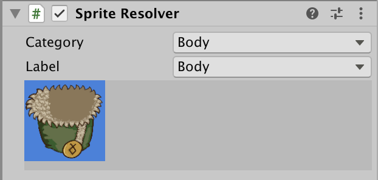

### Swap Full Skin Script
A custom MonoBehaviour script called `SwapFullSkin` is attached to the` Rikr_Root` GameObject. This script is located in `Assets/Samples/2D Animation/[X.Y.Z]/Samples/5 SpriteSwap/Scripts/Runtime/SwapFullSkin.cs`

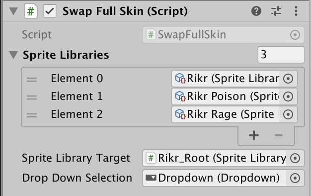

Where a value changes in the UI Drop Down List, the component sets the relevant Sprite Library Asset to be used for the Sprite Library component.

```c++
spriteLibraryTarget.spriteLibraryAsset = spriteLibraries[value];
```

## DLC Swap
This sample demonstrates how to swap Sprite visuals by changing the referenced Sprite Library Asset referenced by the Sprite Library component, using the API provided. This sample uses the Assets and a similar setup to the [Multiple Skinned Sprites](#ex-multiple-skinned-sprites) sample, and builds on the [Full Skin Swap](#full-skin-swap) sample.

This difference from the Full Skin Swap method is that the Sprite Library Asset is loaded from an [AssetBundle](https://docs.unity3d.com/Manual/AssetBundlesIntro.html) during runtime and added to the Sprite Library component at a later time. Open the  `5 DLC Swap.unity` Scene to see the sample in action.

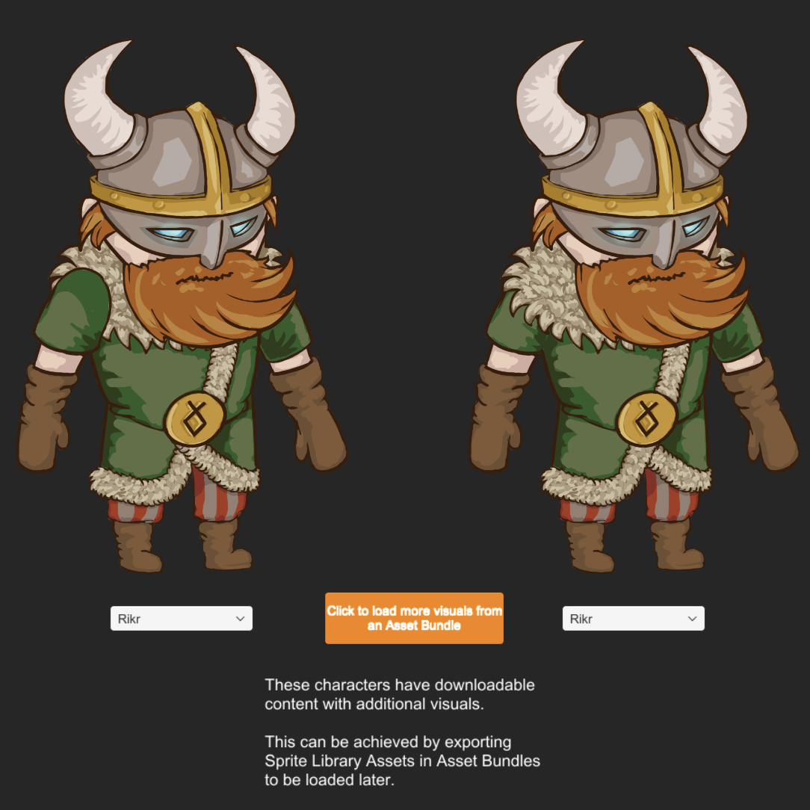

For more information about AssetBundles, please refer to the [AssetBundle documentation](https://docs.unity3d.com/Manual/AssetBundlesIntro.html).

To ensure the AssetBundle works correctly, check that the `Rikr_Poison.spriteLib` and `Rikr_Rage.spriteLib` Assets in `Assets/Samples/2D Animation/[X.Y.Z]/Samples/5 SpriteSwap/Sprite Library` are labeled with their corresponding AssetBundle tag.

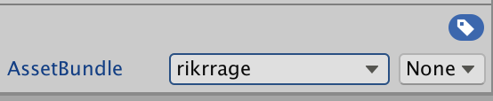<br/>The `Rikr_Rage.spriteLib` Asset labeled with 'rikrrage'.

### Load Swap DLC Script
A custom MonoBehaviour script called `LoadSwapDLC` is attached to the `Load DLC` GameObject. The script is located in `Assets/Samples/2D Animation/[X.Y.Z]/Samples/5 SpriteSwap/Scripts/Runtime/LoadSwapDLC.cs`

The script is starts up when the DLC is loaded, it will scan the AssetBundles for any Sprite Library Assets. Once the Sprite Library Assets are loaded, it will add these Entries into the `SwapFullSkin` script from the [Full Skin Swap](#full-skin-swap) sample.
