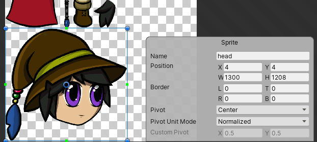
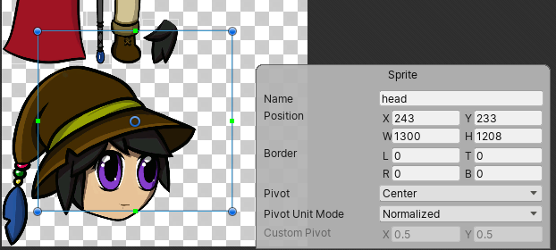
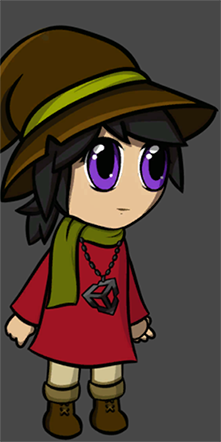
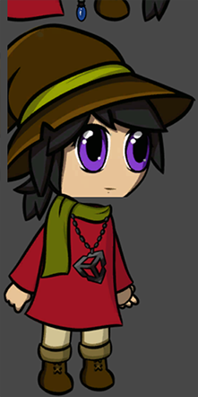
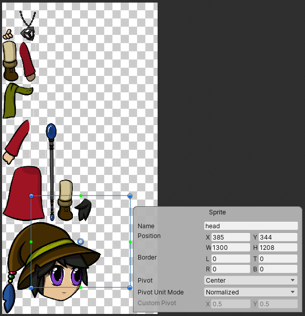
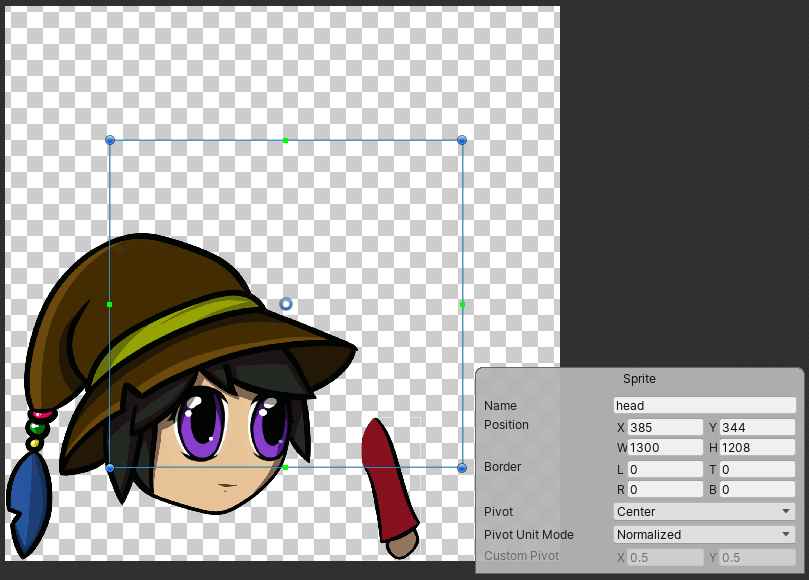
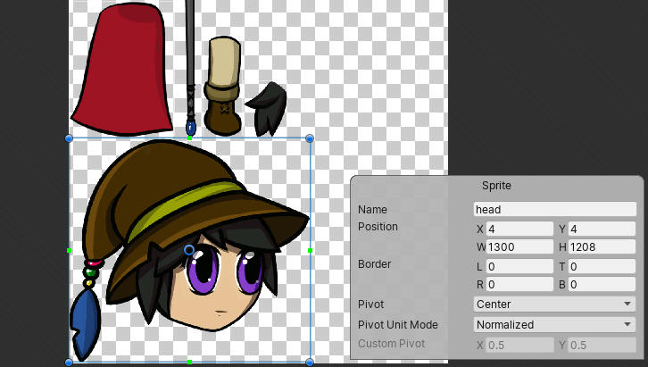
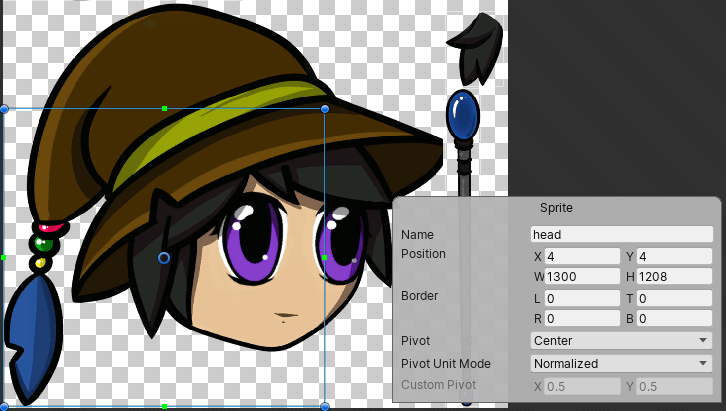

# How the PSD Importer uses SpriteRect data
The PSD Importer can store four separate sets of[ SpriteRect](https://docs.unity3d.com/ScriptReference/Sprite-rect.html) data, with one set per each of the four combinations of Importer property settings below:
   1. When [**Sprite Mode**](PSD-importer-properties.md#SpriteMode) is set to **Single**.
   2. When **Sprite Mode** is set to **Multiple**.
   3. When **Sprite Mode** is set to **Multiple,** and [**Mosaic**](PSD-importer-properties.md#Mosaic) is enabled.
   4. When **Sprite Mode** is set to **Multiple**, both **Mosaic** and [**Character Rig**](PSD-importer-properties.md#character-rig) are enabled, and there is no [Skeleton Asset](PSD-importer-properties.md#main-skeleton) assigned as the [**Main Skeleton**](PSD-importer-properties.md#main-skeleton).
   5. When **Sprite Mode** is set to **Multiple**, both **Mosaic** and **Character Rig** are enabled, and a Skeleton Asset is assigned as the **Main Skeleton**.

Each set of data is persistent, and does not affect or overwrite the data of other sets. This means you can save different SpriteRect data for different importer settings for the same source file. The SpriteRect data persists even if you modify the dimensions and position of images in the source file, as long as the original [Layer ID](https://github.com/adobe-photoshop/generator-core/wiki/Understanding-Layer-IDs-and-Layer-Indices) of the source layers remain the same.

## Modifying the SpriteRect data
The SpriteRect defines the location of the Sprite on the Texture that Unity generates from the imported source file. You can modify the location and size of each SpriteRect in the Sprite Editor.

 Original SpriteRect location of the ‘head’ Sprite on the combined Sprite sheet Texture.

   Drag the corners of the SpriteRect to modify its dimensions and location, or enter the coordinates and dimensions in the Sprite panel.

A SpriteRect’s modified dimensions and location on the Texture is reflected for its respective Sprite in the Scene view.

|                             |                             |
| ------------------------------------------------------------ | ------------------------------------------------------------ |
| Original character prefab and its ‘head’ Sprite with unmodified SpriteRect data. | Character prefab with its ‘head’ Sprite’s SpriteRect data modified.|

When you enable the [Mosaic](PSD-importer-properties.md#Mosaic) importer setting, the PSD Importer arranges the different layers of the source file together to form a single combined Texture when you import it. The importer generates a SpriteRect for each of these imported layers, and follows the position of its associated layer wherever it is placed in the Mosaic Texture.

 The SpriteRect of the ‘head’ layer. The SpriteRect has been moved from its original position.

 The source file reimported after hiding several layers. The SpriteRect follows the ‘head’ layer’s placement in the new Texture.

However, a SpriteRect’s size and position remains the same if you change the image or canvas size of its source layer in the source file. You must manually edit the size and position of the SpriteRect in the Sprite Editor, or select and apply the [Reslice](PSD-importer-properties.md#reslice) option to regenerate it from the source file.

 Original position and size of the SpriteRect for the generated ‘head’ Sprite.

 Position and size of the SpriteRect remains the same after increasing the image size of its source layer.

SpriteRect data persists until you manually delete the SpriteRect, or select the **Reslice** option and apply it in the importer settings. When you do this, Unity discards all user modifications for the current set of SpriteRect data and regenerates all the SpriteRects from the current source file.

## Summary of source file modifications and their effects on SpriteRect data
| __Modification to the source file__             | __Effect on SpriteRect data__                                |
| ----------------------------------------------- | ------------------------------------------------------------ |
| __New layer added /layer visibility turned on__ | The PSD importer automatically generates a new Sprite from the new layer, or newly visible layer, with its associated SpriteRect. |
| __Layer deleted /layer visibility turned off__  | The Sprite and SpriteRect that the PSD Importer generated from the deleted or previously visible layer are also deleted from the Project file. |
| __Layer is renamed__                            | By default, the SpriteRect copies the new name of its source layer. However if you rename the SpriteRect in the Sprite Editor, then it retains its modified name and does not copy the source layer’s new name. |
| __Layer or canvas size changed__                | When a source layer is resized, the size and position of its related SpriteRect remains the same and does not reflect the changes made to its source layer. To make the SpriteRect reflect the changes made to its source layer, manually edit the SpriteRect’s dimensions in the Sprite Editor or select and apply the [Reslice](#Reslice) option in the PSD Importer settings. |

## Name collision errors
A name collision error can happen due to the following reasons:

1. Two or more layers in the imported source file have the same name. However, Photoshop [group layers](https://helpx.adobe.com/photoshop/using/selecting-grouping-linking-layers.html#group_and_link_layers) with the same names do not cause this issue. 
2. A new layer that the PSD Importer creates in the source file has the same name as a SpriteRect you have created or modified. 
3. A layer is renamed to the same name as a SpriteRect you have modified. 
4. A previously hidden layer is made visible and imported, and it has the same name as an existing SpriteRect.

When a name collision occurs, one SpriteRect retains the original name while the other is appended with a running number. Which SpriteRect retains their original name is based on the following priority:

1. A  SpriteRect you have created or modified. 
2. The first layer in the source file, starting from the bottom of the layer stack. 
3. Currently existing SpriteRects in the Project. 

## Keep duplicate names 
Unity’s default import behavior when there are duplicate names is to append "_[number]" to Sprites and SpriteRects it generates from source layers with identical names. Enable this feature to instead have Unity give both Sprites/SpriteRects the exact same name as their source layer even if they have duplicate names.
