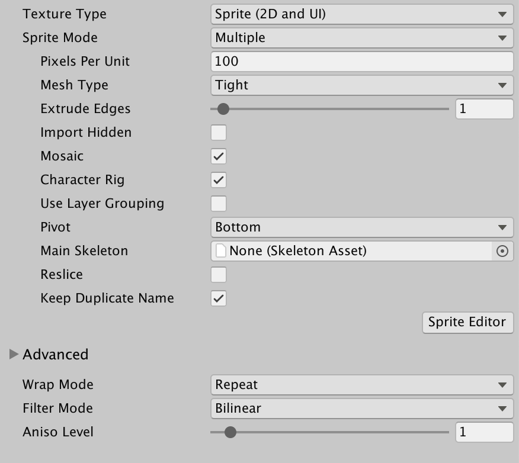
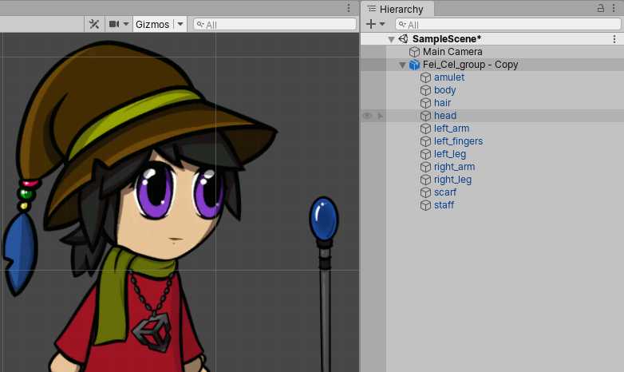
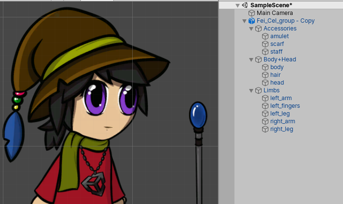

# PSD Importer Inspector properties
After importing a .psb file into your Project, select the Asset file and set its **Texture Type** to [Sprite (2D and UI)](https://docs.unity3d.com/Manual/TextureTypes.html#Sprite). The following PSD Importer properties become available in the Inspector window.

  PSD Importer Inspector properties

| Property                                                     | Function                                                     |
| ------------------------------------------------------------ | ------------------------------------------------------------ |
| __Texture Type__                                             | Select [Sprite (2D and UI)](https://docs.unity3d.com/Manual/TextureTypes.html#Sprite) to import the Texture as a [Sprite](https://docs.unity3d.com/Manual/Sprites.html). This is required to begin using the imported images with the [2D Animation](https://docs.unity3d.com/Packages/com.unity.2d.animation@latest/) package. |
| __Sprite Mode__                                              | Use this property to specify how Unity extracts the Sprite graphic from the image. This property is set to __Multiple__ by default. |
| &nbsp;&nbsp;&nbsp;&nbsp;Single                               | Select this to have imported texture be treated as a single Sprite Asset without multiple parts or elements. This is ideal for characters that are a single layer in the source .psb file, which are not split into multiple layers. |
| &nbsp;&nbsp;&nbsp;&nbsp;Multiple                             | This is the default option. Select this if the imported texture has multiple parts or elements, and is ideal for complex characters which have different parts which are split between multiple layers in the source .psb file as it prepares the characters for animation with the [2D Animation](https://docs.unity3d.com/Packages/com.unity.2d.animation@latest) package. |
| __Pixels Per Unit__                                          | The number of pixels that equal to one Unity unit.           |
| __Mesh Type__                                                | This defines the Mesh type that Unity generates for the Sprite. This is set to __Tight__ by default. |
| &nbsp;&nbsp;&nbsp;&nbsp;[Full Rect](https://docs.unity3d.com/Documentation/ScriptReference/SpriteMeshType.FullRect.html) | Unity maps the Sprite onto a rectangular Mesh.               |
| &nbsp;&nbsp;&nbsp;&nbsp;[Tight](https://docs.unity3d.com/Documentation/ScriptReference/SpriteMeshType.Tight.html) | Unity generates a Mesh based on the outline of the Sprite. If the Sprite is smaller than 32 x 32 pixels, Unity always maps it onto a __Full Rect__ quad Mesh, even if you select __Tight__. |
| [__Extrude Edges__](https://docs.unity3d.com/Manual/Glossary.html#ExtrudeEdges) | Use the slider to determine how much to extend the Mesh from the edge of the Sprite. |
| __Import Hidden__                                            | Enable this property to include the hidden [layers](https://helpx.adobe.com/photoshop/using/layer-basics.html#layers_panel_overview) of the .psb file in the import. This produces the same import result as making all layers visible in the source file unhiding all layers in the source file before you importing it into Unity. Clear this option if you want to only import the visible layers in the .psb file. |
|  __Mosaic__                              | This setting is only available if you set the __Texture Type__ to __Multiple__. Enable this setting to make the PSD Importer generate Sprites from the imported layers and combine them into a single Texture in a Sprite sheet layout. |
| [__Character Rig__](#character-rig)                                    | Enable this property to make the importer generate a [Prefab](https://docs.unity3d.com/Manual/Prefabs.html) based on the imported source file. The PSD Importer generates Sprites from the imported layers of the source file, and the Sprites’ [hierarchy](https://docs.unity3d.com/Manual/Hierarchy.html) and positions are based on their [layer hierarchy](https://helpx.adobe.com/photoshop/using/layer-basics.html#layers_panel_overview) and their positions in the .psb file. |
| __Use Layer Grouping__                                       | This setting is only available when you enable __Character Rig__. Enable this setting to make the importer generate a Prefab that follows the layer and grouping hierarchy of the imported .psb. file. |
| __Pivot__                                                    | This is only available when **Character Rig** is enabled. Select the pivot point of the Sprite. |
| &nbsp;&nbsp;&nbsp;&nbsp; Custom                              | Define the X and Y coordinates of a custom __Pivot__ location. |
| [__Main Skeleton__](#main-skeleton)                                            | This is only available when **Character Rig** is enabled. Assign the [Skeleton Asset](#main-skeleton) that this character Prefab’s bone hierarchy will reference.  If no Skeleton Asset is assigned, the importer will automatically generate a Skeleton Asset as a sub-asset of this character. The Skeleton Asset contains the bone hierarchy of the Asset that was defined in the [Skinning Module]() (refer to [Skeleton Sharing](skeleton-sharing.md) for more information). |
| [__Reslice__](#reslice)                                      | This is available only when **Mosaic** is enabled. Enable this setting to regenerate the Sprite from the imported layers and clear any changes you have made to the Sprite and its metadata. |
| [__Keep Duplicate Name__](#keep-duplicate-name)                        | Enable this setting to make the PSD Importer generate Sprites from the source files with the exact same name as their source layers, even when there are multiple layers with the same name. |

## Property details
### Character Rig
Enable this property to have the PSD Importer generate a Prefab containing [Sprites](https://docs.unity3d.com/Manual/Sprites.html) based on the layers of the imported source file. The PSD Importer also automatically gives the Sprites an [Order in Layer](https://docs.unity3d.com/Manual/2DSorting.html#sortlayer) value that sorts them according to their positions in the layer hierarchy in the source file. As a result, the generated Prefab recreates the arrangement and appearance of the assets in the original source file as closely as possible.

The name of each Sprite in the Prefab is the same as the source layer it is based on, unless a [name collision error](PSD-importer-SpriteRect.md#name-collision-errors) occurs, which is usually due to duplicate names in the source layers.

If the Sprite contains [bone](https://docs.unity3d.com/Packages/com.unity.2d.animation@6.0/manual/SkinEdToolsShortcuts.html#bone-tools) or [weight](https://docs.unity3d.com/Packages/com.unity.2d.animation@6.0/manual/SkinEdToolsShortcuts.html#weight-tools) data, the PSD Importer automatically adds the __Sprite Skin__ component to it. This happens if the Sprite has been [rigged](https://docs.unity3d.com/Packages/com.unity.2d.animation@6.0/manual/CharacterRig.html) with bones and weights in the [Skinning Editor](https://docs.unity3d.com/Packages/com.unity.2d.animation@6.0/manual/SkinningEditor.html) already and the source file is being reimported, or you have manually [copied and pasted](https://docs.unity3d.com/Packages/com.unity.2d.animation@6.0/manual/CopyPasteSkele.html) the bone and weight data onto the Sprites.

Refer to the examples below of a character designed in Photoshop, and how its original layer hierarchy is transposed to the Prefab.

   Example 1: Character artwork in Photoshop with different parts separated into different Photoshop layers.

   Example 2: The generated Prefab with Sprites sorted according to the source file’s layer hierarchy.

   Example 3: The generated Prefab of the same source file but with the [Layer Grouping](#LayerGrouping) setting enabled.

### Main Skeleton
A skeleton Asset (.skeleton) is an Asset that contains the bone hierarchy structure that can be animated with the 2D Animation package. The **Main Skeleton** property is only available when you import a .psb file with the [**Character Rig**](#character-rig) importer setting enabled. After importing the .psb file, assign a .skeleton Asset to the **Main Skeleton** property to have the generated prefab character be automatically rigged with the bone hierarchy structure contained in that .skeleton Asset.

If there is no .skeleton Asset assigned to the importer’s **Main Skeleton** property, then a .skeleton Asset is automatically generated as a sub-Asset of the imported source file and it will be named ‘[Asset File Name] Skeleton’. You can [share .skeleton Assets](skeleton-sharing.md) between different generated Prefabs by assigning the same .skeleton as their **Main Skeleton** property when they're imported.

When you open and edit the character in 2D Animation package’s [Skinning Editor](https://docs.unity3d.com/Packages/com.unity.2d.animation@6.0/manual/SkinningEditor.html), the module will display the bone hierarchy provided by the Skeleton Asset assigned to **Main Skeleton** for rigging.  

### Reslice
Enable this setting to discard all user modifications for the current set of [`Sprite.Rect`](https://docs.unity3d.com/ScriptReference/Sprite-rect.html) data and regenerate all `Sprite.Rects` based on the current source file. Extra `Sprite.Rect` metadata (such as weights and bones data) persist if they remain valid with the regenerated `Sprite.Rects`.

### Keep Duplicate Name
Unity’s default import behavior when there are duplicate names is to append "_[number]" to Sprites and `Sprite.Rects` it generates from source layers with identical names. Enable this feature to instead have Unity give both Sprites/`Sprite.Rects` the exact same name as their source layer even if they have duplicate names.

## Name collision errors
A name collision error can happen due to the following reasons:
1. Two or more layers in the imported source file have the same name. However, you can use Photoshop's [group layers](https://helpx.adobe.com/photoshop/using/selecting-grouping-linking-layers.html#group_and_link_layers) feature to group layers with the same names to solve this issue.
 
2. A new layer that the PSD Importer creates in the source file has the same name as a `Sprite.Rect` you have created or modified.
 
3. A layer is renamed to the same name of a `Sprite.Rect` you have modified.
 
4. A previously hidden layer is made visible and imported, and it has the same name as an existing `Sprite.Rect`.

When a name collision occurs, one `Sprite.Rect` retains its original name while the other is appended with a running number. Which `Sprite.Rect` retains their original name is based on the following priority:

1. A `Sprite.Rect` you have created or modified.

2. The first layer in the source file, starting from the bottom of the layer stack.

3. Currently existing `Sprite.Rects` in the Project.
