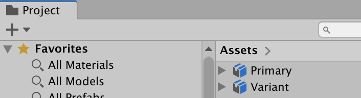
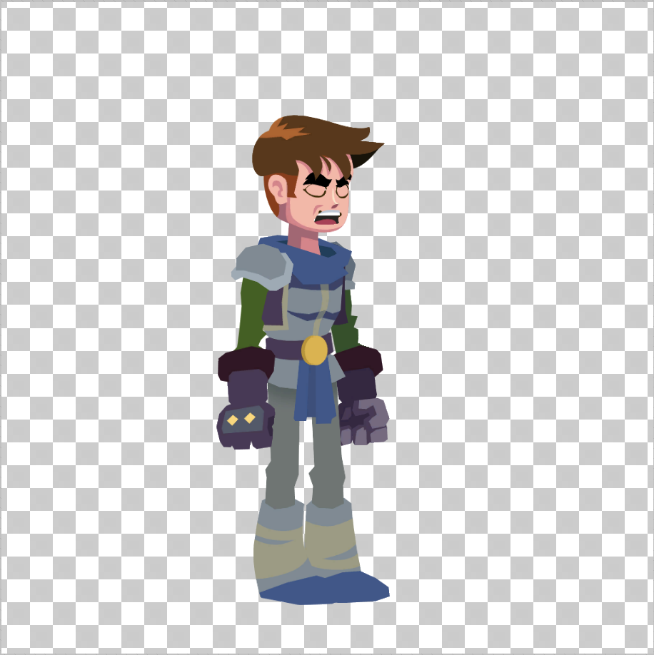
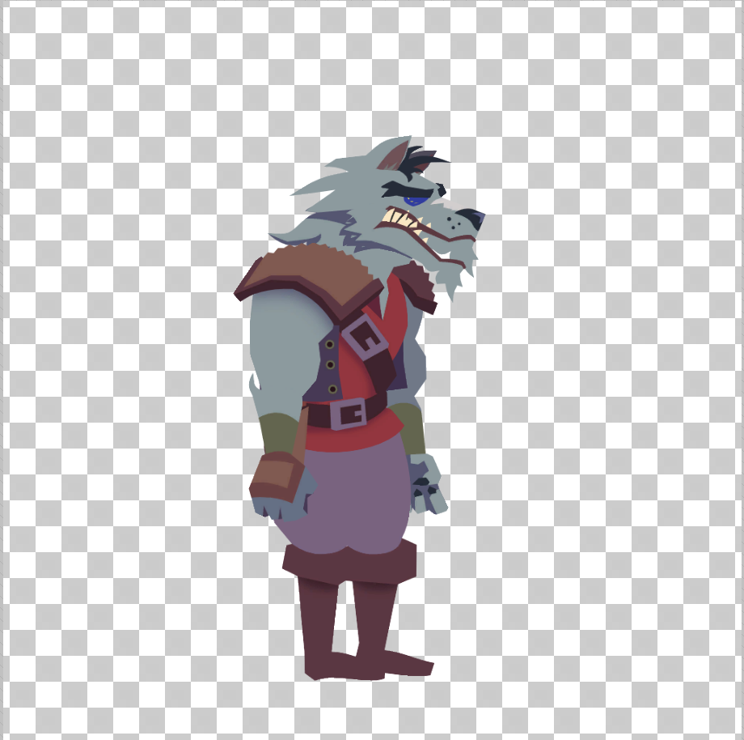
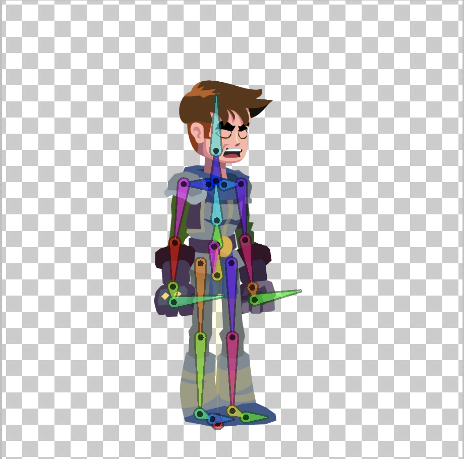
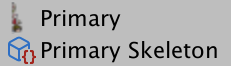
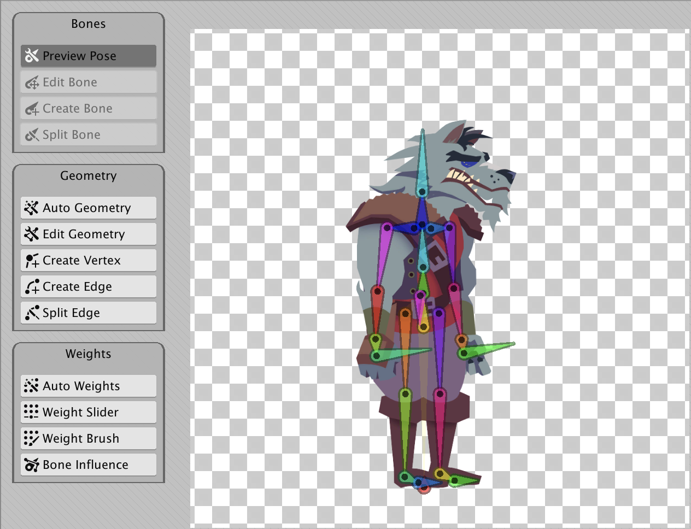

# Skeleton sharing
You can share [.skeleton Assets](PSD-importer-properties.md#main-skeleton) between different imported Assets by assigning the .skeleton Asset from one to the other's **Main Skeleton** property. This feature can be used together with the [2D Animation package](https://docs.unity3d.com/Packages/com.unity.2d.animation@latest) to edit the [bones](https://docs.unity3d.com/Packages/com.unity.2d.animation@6.0/manual/SkinEdToolsShortcuts.html#bone-tools) of the .skeleton Assets in the 2D Animation package's [Skinning Editor](https://docs.unity3d.com/Packages/com.unity.2d.animation@6.0/manual/SkinningEditor.html).

To demonstrate how to skeleton sharing, refer to the following example of two actors (characters or other Assets imported for animation with the 2D Animation package) that were imported into Unity with the PSD Importer called 'Primary' and 'Variant'. The goal is to share the .skeleton Asset of 'Primary' with 'Variant'.

  |  
--|--
Primary  | Variant

The [2D Animation package](https://docs.unity3d.com/Packages/com.unity.2d.animation@latest) is required to create and edit the bones of the .skeleton Assets of imported Assets. In this example, the bones of 'Primary' are created and rigged in 2D Animation's [Skinning Editor](https://docs.unity3d.com/Packages/com.unity.2d.animation@6.0/manual/SkinningEditor.html) (refer to the [2D Animation package](https://docs.unity3d.com/Packages/com.unity.2d.animation@latest) documentation for further information).

 A bone hierarchy connected together to form the skeleton of 'Primary'.

When importing an Asset without anything set in the **Main Skeleton** property, the PSD Importer generates a .skeleton Asset for the Asset and automatically names it as '[Asset File Name] Skeleton'. Any [bones rigged](https://docs.unity3d.com/Packages/com.unity.2d.animation@6.0/manual/SkinEdToolsShortcuts.html#bone-tools) for 'Primary' is saved to the .skeleton Asset 'Primary Skeleton'.

To share the 'Primary Skeleton' with 'Variant', select 'Variant' and go to its PSD Importer settings. Assign 'Primary Skeleton' to the **Main Skeleton** property to have 'Variant' reference that .skeleton Asset as its own bone hierarchy.

 The [Bone tools](https://docs.unity3d.com/Packages/com.unity.2d.animation@6.0/manual/SkinEdToolsShortcuts.html#bone-tools) are greyed out and unavailable when opening 'Variant' in the Skinning Editor.

When an actor references another actor's .skeleton Asset instead of its own, the [Bone Tools](https://docs.unity3d.com/Packages/com.unity.2d.animation@6.0/manual/SkinEdToolsShortcuts.html#bone-tools) in the Skinning Editor are disabled. To edit the bones, open the original actor (that the .skeleton Asset belongs to) in the Skinning Editor and edit the bones. Any changes to the original .skeleton Asset is reflected in any actor which references it. In this example, changes made to 'Primary Skeleton' are reflected in the 'Variant' actor's bone hierarchy .
